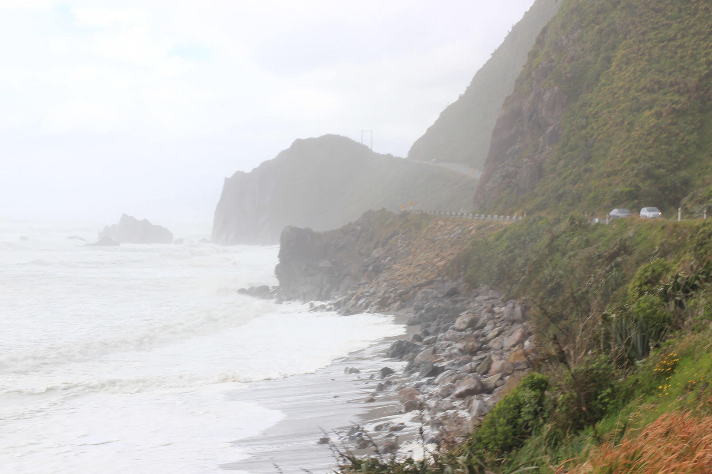

Nach dem misslungenen Fox Gletscher-Aufenhalt machten wir uns im strömenden Regen entlang der rauen Westküste auf nach Marahau. Eine reine Fahrzeit von 7,5 Stunden zum Abel Tasman Nationalpark lagen vor uns.
Es ging durch viel Regen, vorbei an stürmischen Küsten zum ersten Zwischenstopp – Hokitika. In dem kleinen Örtchen besuchten wir u. a. eine Jadeausstellung. Das typisch neuseeländische Gestein wird hier in allen Schmuckvarianten verabreitet und angeboten :)

Vom weiterhin verregneten Hokitika fuhren wir weiter gen Norden zu den Pancake-Rocks. Bei sehr stürmischem Wetter (ohne Regen :) ) peitschte die See gegen die aufgestapelten Pfannkuchenähnlichen Felsen. Die Gischt wurde durch die Luft gepustet und es war ein tolles Schauspiel die tobende See vor den berühmten Felsen zu beobachten. Wir hatten bis hier hin gut 2/3 unserer Strecke geschafft.

[raw]
[/raw]

[raw]
[/raw]

Nach gut einer Stunde verließen wir die raue Westküste und fuhren landeinwärts. Langsam schwang das Wetter um und die Sonne kam langsam heraus :) Vorbei an Weinplantagen, wunderschönen Tälern und über viele Gebirge kamen wir dem schönen Abel Tasman Nationalpark immer näher.
Im Dunklen erreichten wir dann unsere Unterkunft für die nächsten 3 Nächte – die Marahau Lodge war eine schön angelegte „Hütten-Anlage“…  Unsere Hütte war auf den ersten Blick schon mal wesentlich schöner als die letzten Unterkünfte und so konnten wir frohen Mutes und mit der Hoffnung auf schönes Wetter beruhigt einschlafen!

[raw]
[/raw]

[raw]
[/raw]
