Für den heutigen Tag stand eine Bootstour entlang der Küste des Abel Tasman Nationalparks an. Das Boot startete in dem benachbarteten Küstendorf Kaiteriteri. Die Fahrt ging 2.5 Stunden entlang der Küste, vorbei an der gestern besuchten Robbeninsel, bis zur Spitze des Nationalparks und ein Stückchen wieder zurück. An der Metland-Bay wurden wir dann abgesetzt. Von hier aus begannen wir unseren Abschnitt des Abel Tasman Coastal-Tracks zu laufen. Es lag ein 4,5 Stunden Track vor uns bevor wir mit dem Katamaran an der Anchorage Bay wieder abgeholt werden sollten.

[raw]
[/raw]
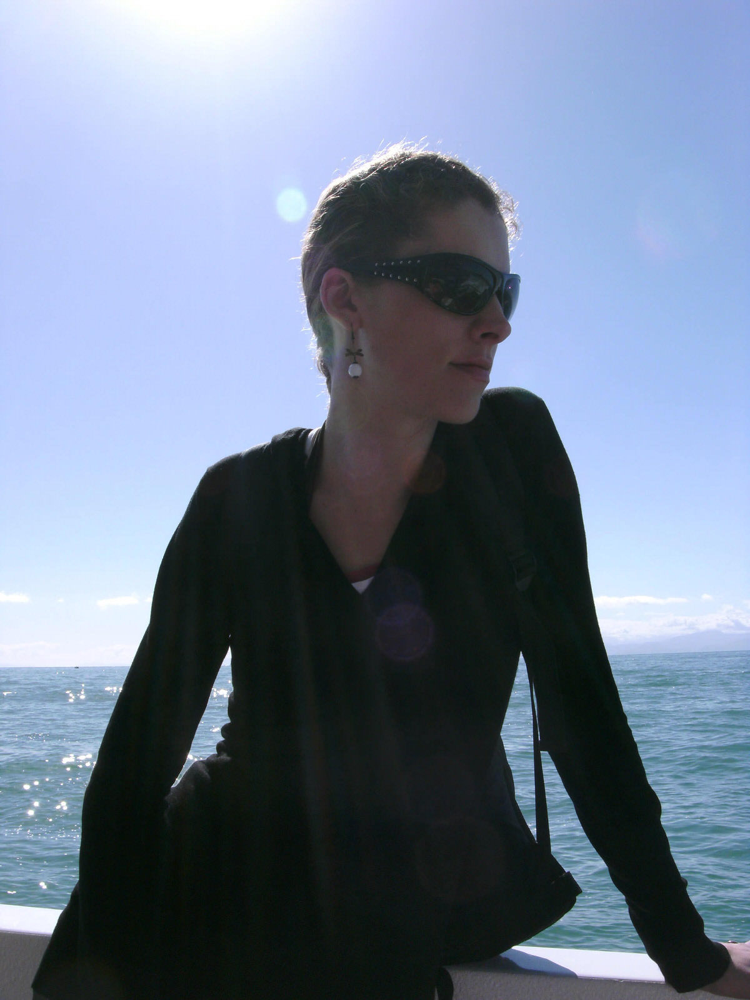
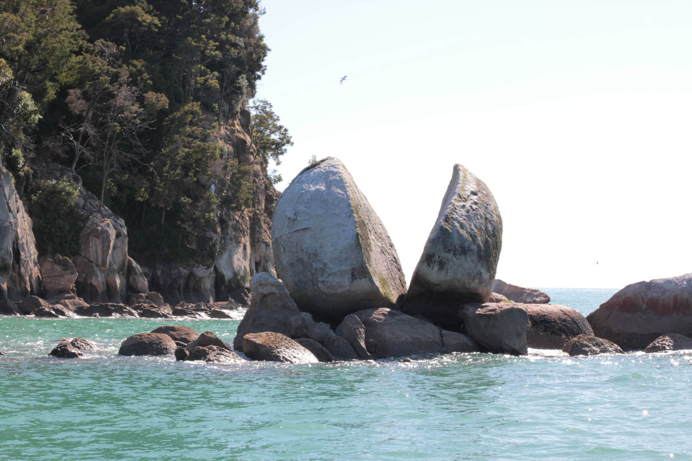
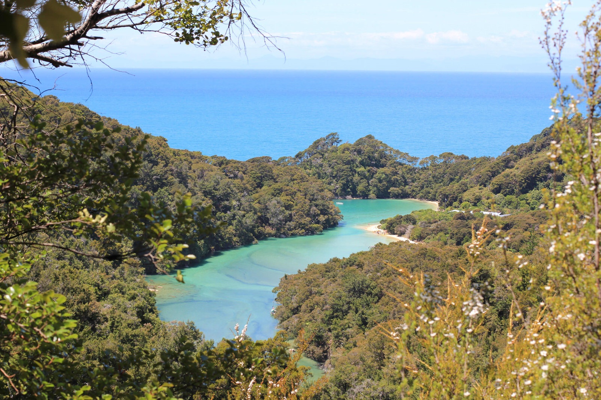
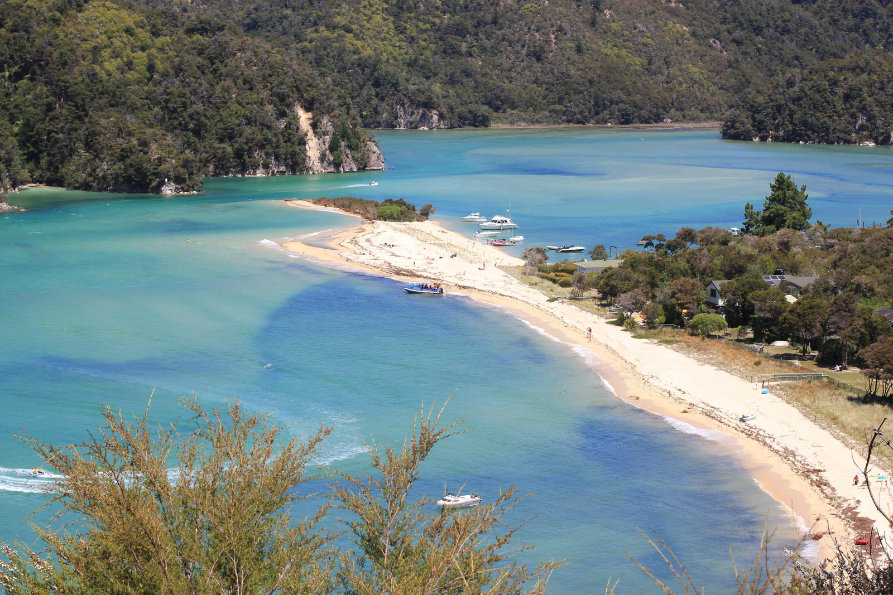
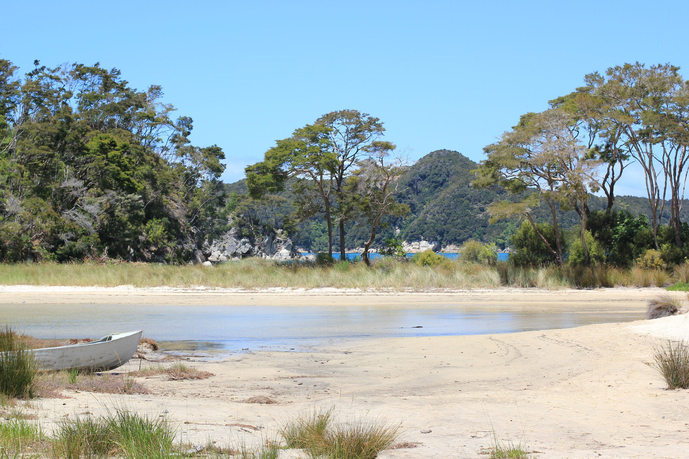
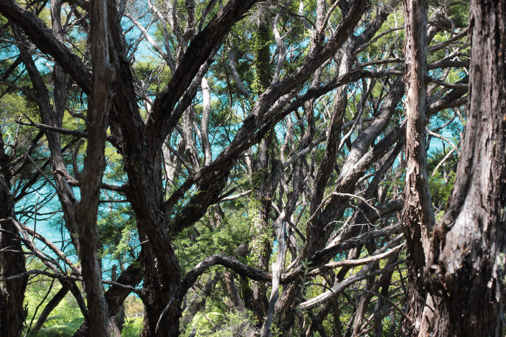
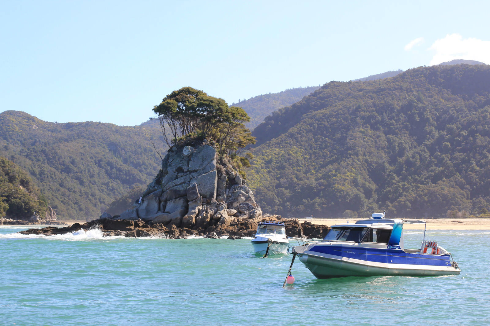
[raw]
[/raw]

Vom wunderschönen Strand ging es zunächst in die Berge der Küste hinauf. Zwischen den regenwaldähnlichen Wäldern konnte man eigentlich immer das türkisfarbe Wasser sehen und das Tasman Meer rauschen hören.

Es war ein völlig anderer Track als der Key Summit Track vor einigen Tagen. Auf der Hälfte der Strecke erreichten wir die Torrent Bay – ein privater Strand der von einigen Anwohnern vor der National Park Erschließung in Beschlag genommen wurde :)  Von hier aus konnte man zwei Tracks gehen je nach Gezeitenlage. Zur Anchorage Bay gabs zum Einen den 30 Minuten Track bei Ebbe und  zum Anderen den 100 Minuten Track bei Flut, den wir nun nehmen „mussten“. Entlang einer Lagune führte unser Weg zum Torrent River, der in einem wunderschönen Bach verlief. Von dort aus machen wir einen Abstecher zu Cleopatra’s Pool. Diese wunderschöne Stelle am oberen Bachlauf lässt sich schwer beschreiben, daher zeige ich einfach Bilder :)

[raw]
[/raw]
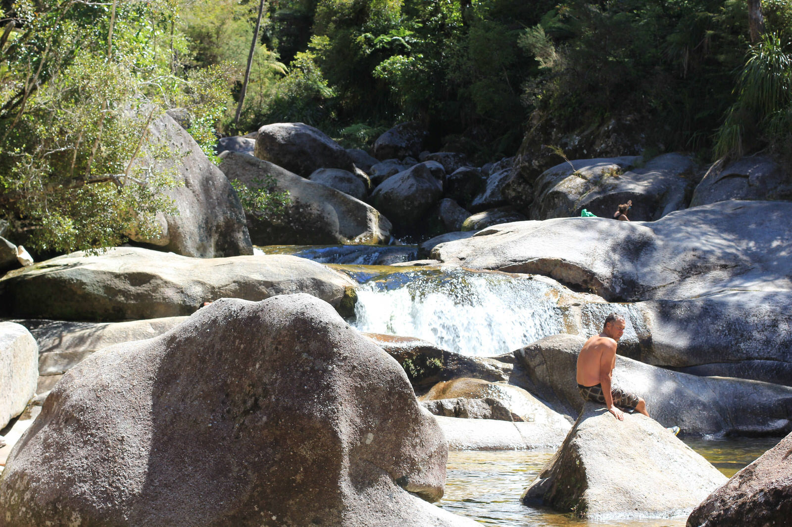
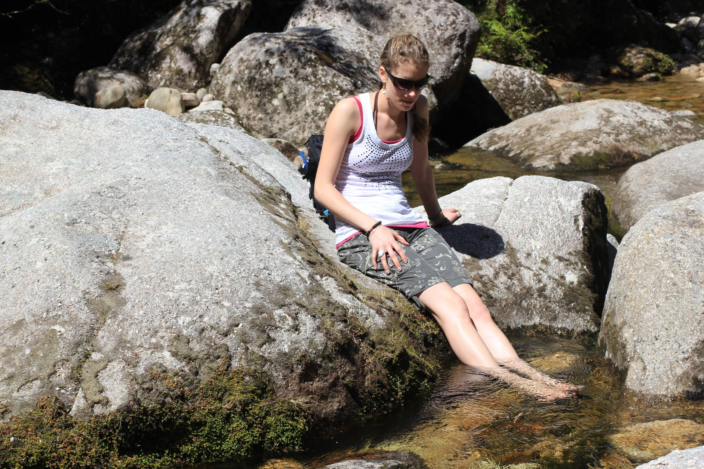
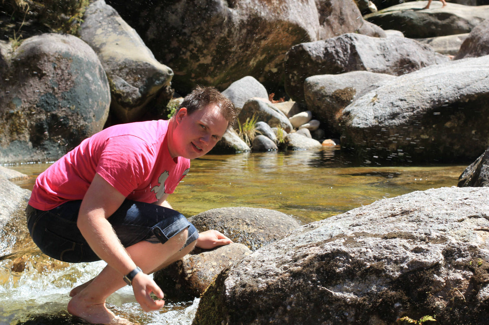
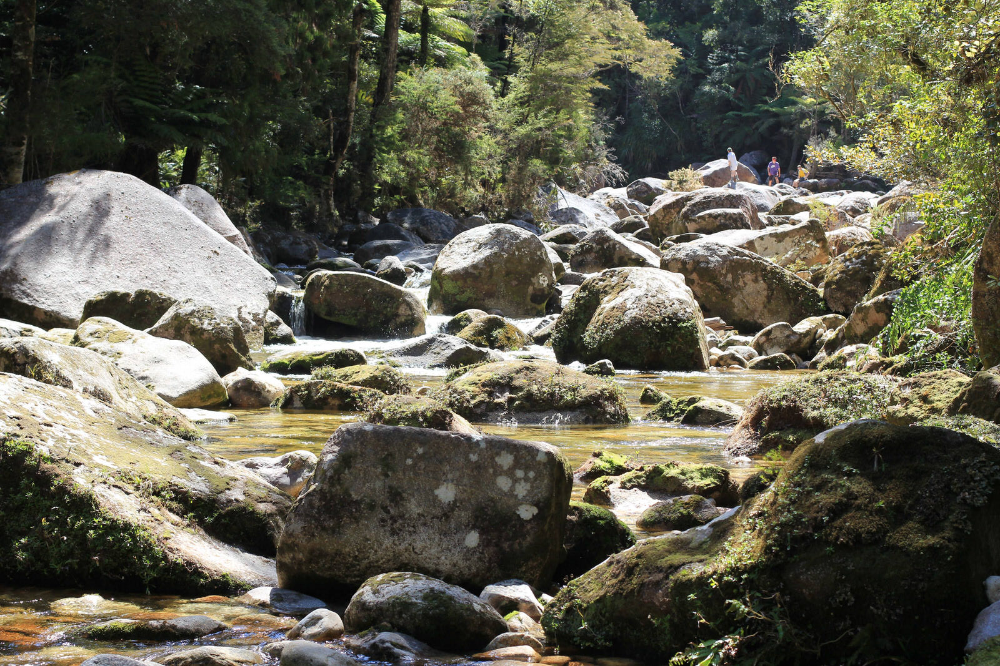
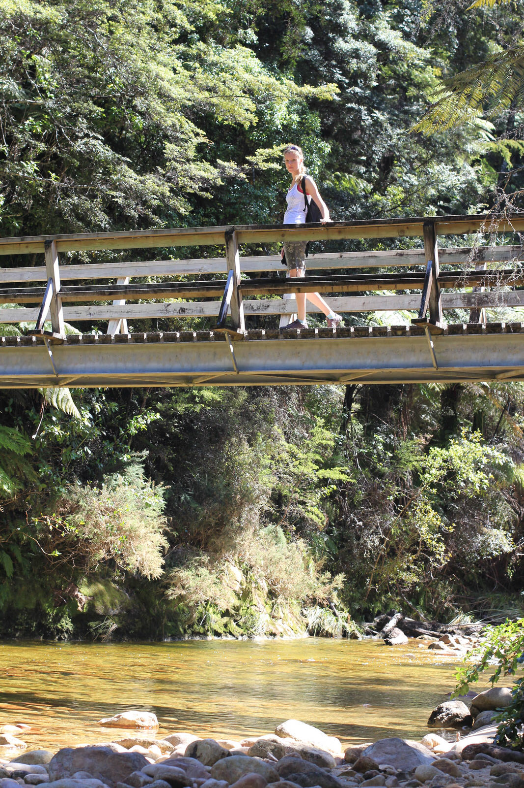
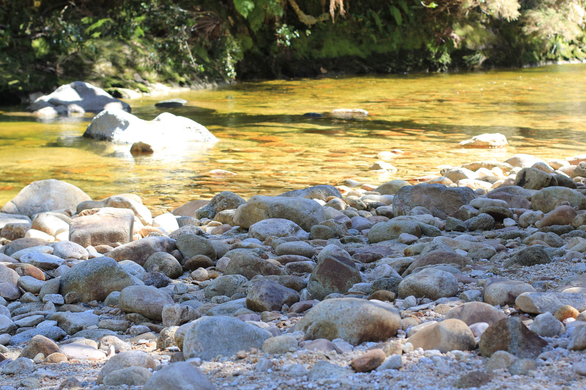
[raw]
[/raw]

Nach kurzem Verweilen am erfrischend ;) kühlen Wasser ging es dann weiter bis zur Anchorage Bay, wo wir kurz darauf auch vom Boot abgeholt wurden.
Nach Ankunft in Kaiteriteri und der Fahrt zurück nach Marahau, ließen wir dann unseren letzten  Abend auf der Südinsel und im schönen Abel Tasman Nationalpark auf der Terasse unserer Lodge bei lecker gekochtem Essen ausklingen.
