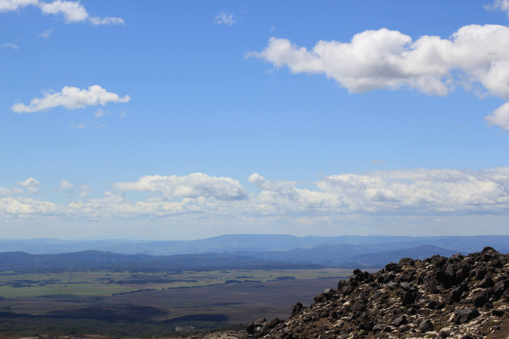
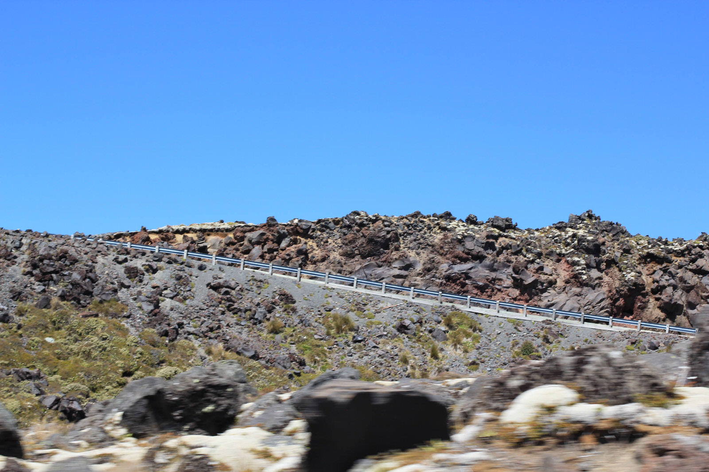
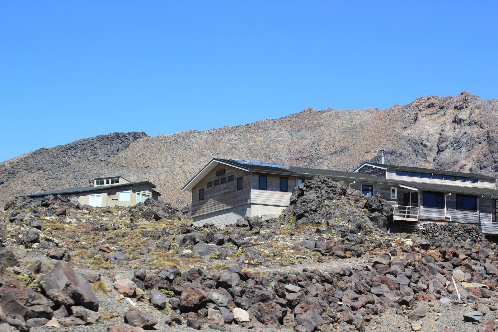
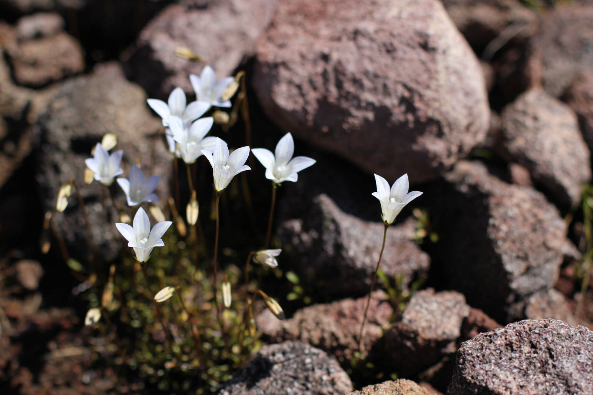
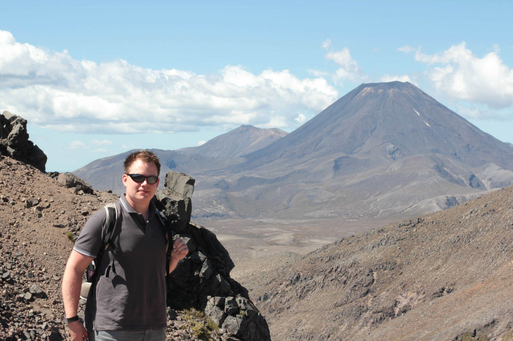
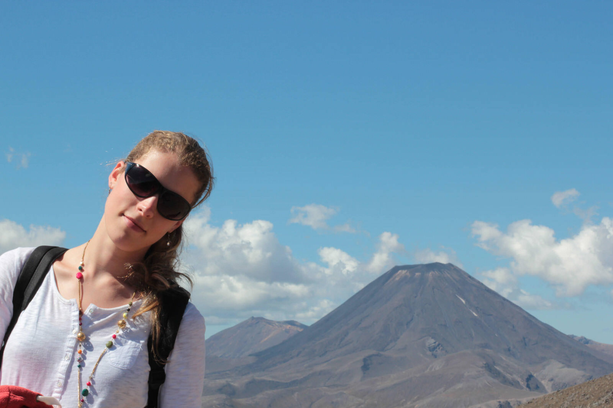
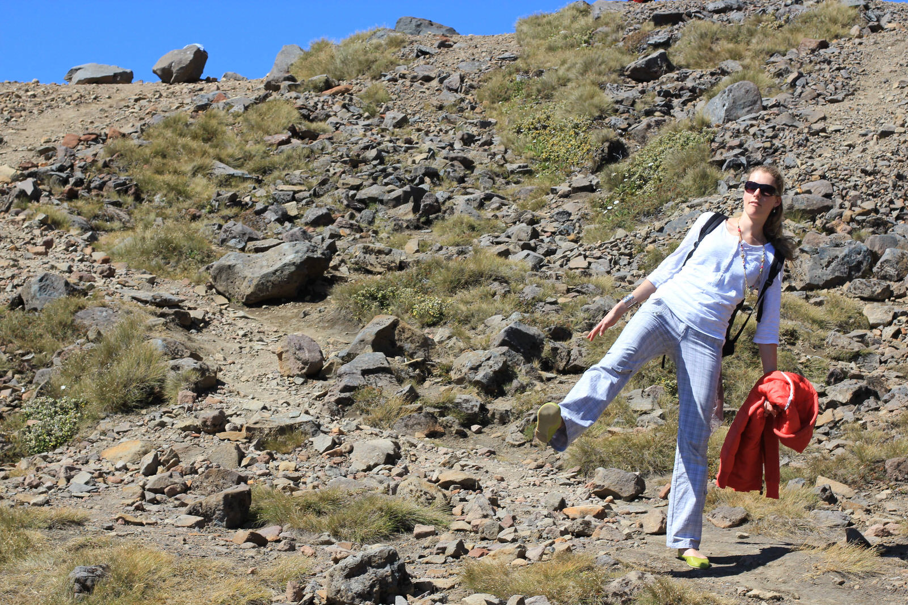

Nach den letzten nicht so fahrintensiven Tagen stand heute wiede eine längere Fahrt von Plimmerton zum Tongariro Nationalpark, dem Vulkanland, an. Zusätzlich zu den reinen 4 Stunden Fahrzeit machten wir noch ein paar Pausen, sodass wir leider erst um 14:30 den Nationalpark erreichten. Bei unserer heimischen Urlaubsplanung hatten wir eigentlich einen Teil des Tongariro Moon Crossings (8 Stunden Track durch die Vulkanlandschaft) angedacht, doch aufgrund der späten Ankunft wollten wir dann die einzige zur Sommer-Saison geöffnete Gondel zu dem größten Vulkan Mt Ruapehu (2797m) mit schneebedecktem Gipfel nehmen.
Als wir dann an die Gondelstation in einer Höhe von ca. 1200 Metern mit dem Auto ankamen, war diese gerade geschlossen... Uns blieb noch eine kleine eigene Exkursion im Vulkangestein am Berg entlang übrig… Die Aussicht auf die Vulkanberge, dem Schicksalsberg (aus Herr der Ringe), eigentlich Mt Ngauruhoe – ja die Herr der Ringe Filmsets sind auch hier zu finden :) – und die umliegenden verlassenen Täler waren auch sehr schön.

[raw]
[/raw]

[raw]
[/raw]

Aus unserem Reiseführer erfuhren wir dann, dass unsere Zwischenstation eines der größten Skigebiete Neuseelands ist und zum Sommer, außer für Wanderer nicht so viel los ist. Im Winter befördern hier 16 Skilifte durchschnittlich 20.000 Skifahrer pro Stunde zu den Pisten und es ist der Teufel los :)  Für uns im Sommer war es eher sehr still und fast unheimlich mit den ganzen verlassenen Skihütten am Berg.
Wir checkten dann in dem Bayview Chateau Tongariro in Whakapapa Village ein und schauten uns im schönen, alten Chateau einen Film über Maoris im hauseigenen Kinoraum an…
