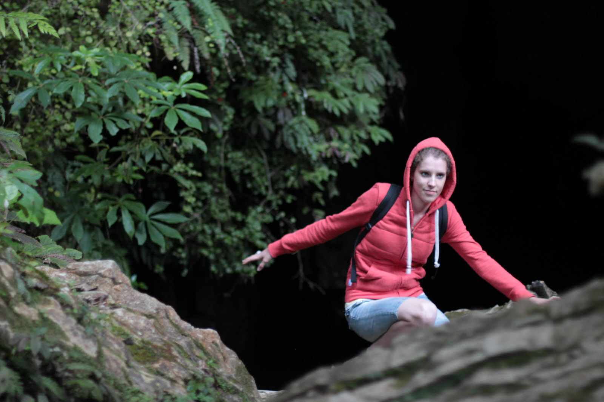
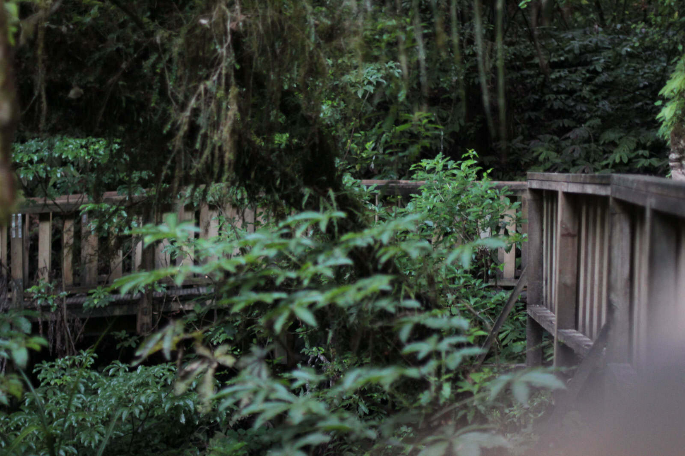
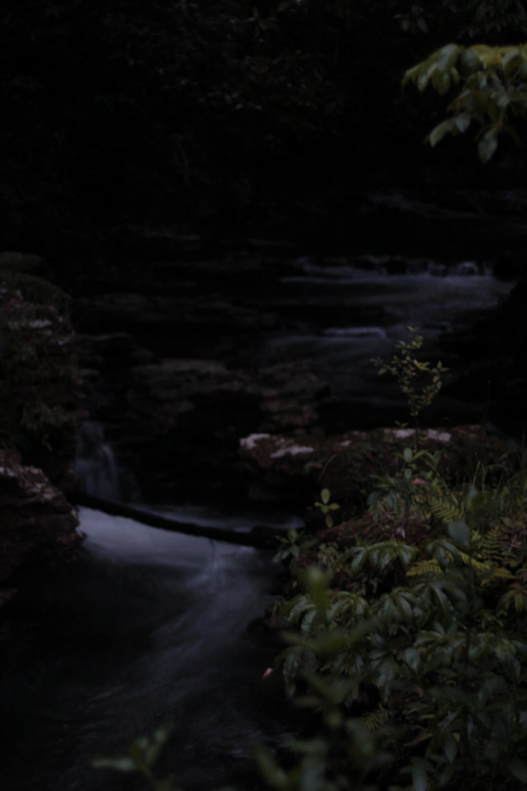
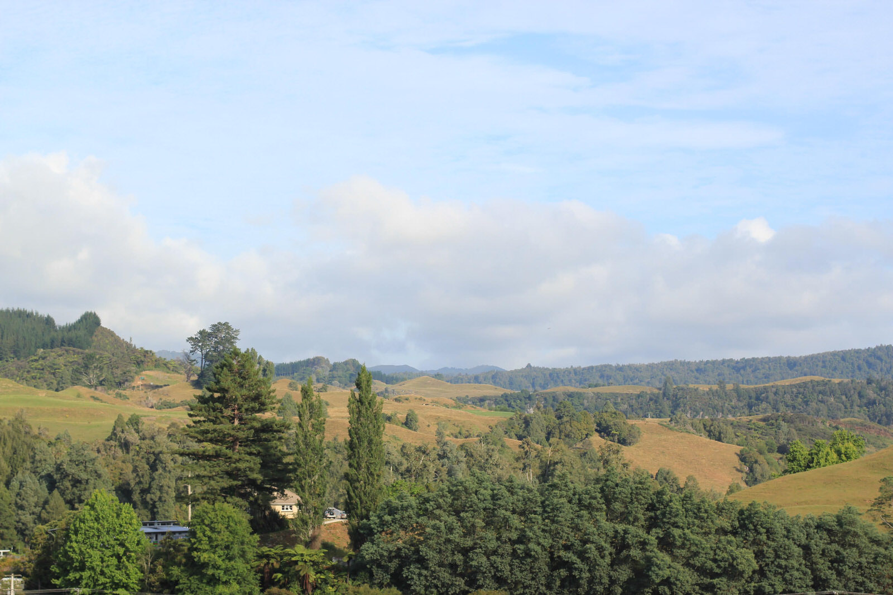
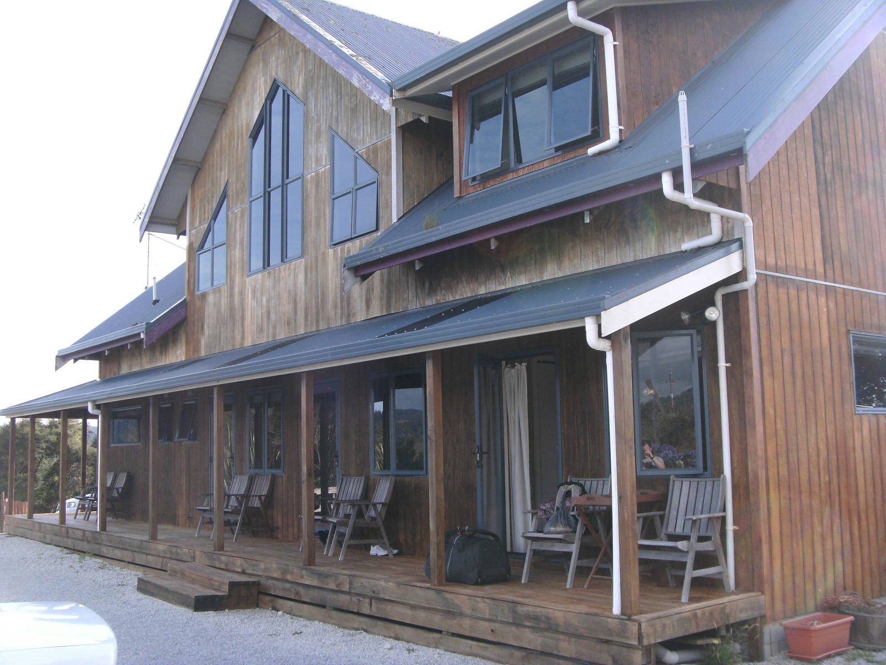

Von Rotorua ging es zur Glühwürmchenhochburg – Waitomo Caves. In knapp 2 Stunden erreichten wir das kleine Dörfchen, von wo aus man mit zahlreichen Unternehmen verschiedenste Touren zu unterschiedlichen unterirdischen Höhlen starten kann. Die Varianten reichen von geführten „Spaziergängen“ über Abseilausflügen und abenteuerlichen Black Water Rafting Touren mit Toobs (große Schwimmreifen) und ohne…  Am Vortag in Rotorua entschieden wir uns bereits für die Tumu Tumo Toobing Tour (eine nasse 4-stündige Angelegenheit mit den besagten Toobs).

Nach einem Besuch im Waitomo Cave Museum ging dann unsere Tour um 14:30 los. Mit einem Bus fuhren wir zu 10. + 2 Guides zu einer Hütte umgeben von Schafskoppeln. Dort zogen wir unsere Cavekleidung an – eine dicke sehr eng sitzende Taucher-Hose, -Jacke, „Gummi-Socken“ und natürlich einen Helm mit Lampe. Beinahe vergessen, doch auch ganz wichtig :) die weißen Gummistiefel. Mit dem Gefühl sich wie ein Roboter oder Terminator zu bewegen.
Nach einem 10-minütigen Fußmarsch über einige Schafskoppeln erreichten wir dann den Abstieg hinab in die Höhlenwelten. Nach zahlreichen Krakselein, Krabbelein und Rutscherein :) kam die Stelle wo wir zum ersten Mal unsere Lampen ausstellten und schon erblickten wir super deutlich  zahlreiche Glühwürmchen an der Decke hängend.
Der Guide klärte uns darüber auf, dass die „Glühwürmchen“ eigentlich eher Glühpuppen heißen müssten und eigentlich das Leuchten (die Luminessenz) ein Anlocken der Beute (Insekten) für die hungrigen Würmer ist. Das leuchtende Hinterteil der Puppe lockt Insekten an, die sich in den zuvor von den Glüh-Würmern gesponnen Fäden verfangen sollen. Das eigentliche Insekt im Endentwicklungsstadium lebt nur 2-3 Tage und das ohne Verdauungsorgane oder Mund – dieses Stadium dient lediglich der Fortpflanzung…
Nun aber mal weiter mit dem Tourbericht :)  Nach einigen Metern durch das kalte Höhlenwasser (laufend und schwimmend) und auch engen Gängen durch die man teilweise nur blind hindurch kriechen konnte,  kamen dann auch 2 mal die Toobs zum Einsatz!
Beim ersten Einsatz, nach einem „Sprung“ rückwärts ins Wasser mit dem Gummireifen am Hintern für den richtigen Sitz :) , fuhren wir den größten Glühwürmchen-Bereich der Höhle an . Es wurden einige Lieder angestimmt und es war einfach einzigartig in den „Glühwürmchenhimmel“ zu schauen.  Ca. 30 Minuten vor Ende der Tour wurden noch Marschmello-„Fische“  umzogen von Schokolade und heißer Zitronentee gereicht. Einfach toll unterirdisch einen kleinen Snack einzunehmen, zumal der heiße Tee schön aufgewärmt hat. Danach gings wieder ab ins kalte Nass. Nach ca. 2 Stunden Untertage kamen wir aus der Dunkelheit der Höhle wieder ans Tageslicht. Eine heiße Dusche in der Hütte stand an :)  Die Tour war einfach großartig, doch leider können wir hiervon keine Fotos zeigen, da es nicht erlaubt war Fotos zu schießen…

Im nahe gelegenen, schön eingerichteten Abseil Breakfast Inn checkten wir dann gegen Abend ein und folgten der Empfehlung der Hausbesitzerin und aßen lecker ein süßes Dessert im Huhu – Café. Kurz vor Dunkelheit fuhren wir dann noch zu einem der Top 10 Kurzwalks, auf dem man neben toller Natur auch einige natürliche Tunnel, Stromschnellen, Brücken und auch Glühwürmchen sehen konnte. Diese Tour, wenn auch etwas gruselig – bei nahezu vollständiger Dunkelheit durch den Wald – hat sich total gelohnt und ich konnte viele schöne Fotos machen!

[raw]
[/raw]

[raw]
[/raw]

Sogar ein paar Glühwürmchen sind dabei  :)
