Von dem sonnigen Hahei sind wir mit dem Auto ca. 6 Stunden nördlich und vorbei an Auckland zur Bay of Islands gefahren…  Auckland scheint eine echt riesige Stadt zu sein und auch ganz anders als die Städte, die wir bisher gesehen haben. Wir werden das ja aber noch genauer erkunden am 19.01. Ungefähr 1 Stunde vor Auckland wurde das Wetter dann leider schlechter. (Niesel)regen und schwüle Luft lösten das sommerlich heiße Wetter ab. Als wir dann endlich in Paihai angekommen sind, hatte sich das Wetter leider immer noch nicht gebessert. Ein Blick über die Bucht war leider wegen dem häftigen Nebel nicht wirklich möglich, so dass wir uns nur in der Stadt umsehen konnten. Ahh nicht zu vergessen wir waren bei den Hundertwasser Toiletten :) die wurden hier 1999 in einem Nachbardorf erbaut und sind das einzige Hunderwasserprojekt in Neuseeland.

[raw]
[/raw]
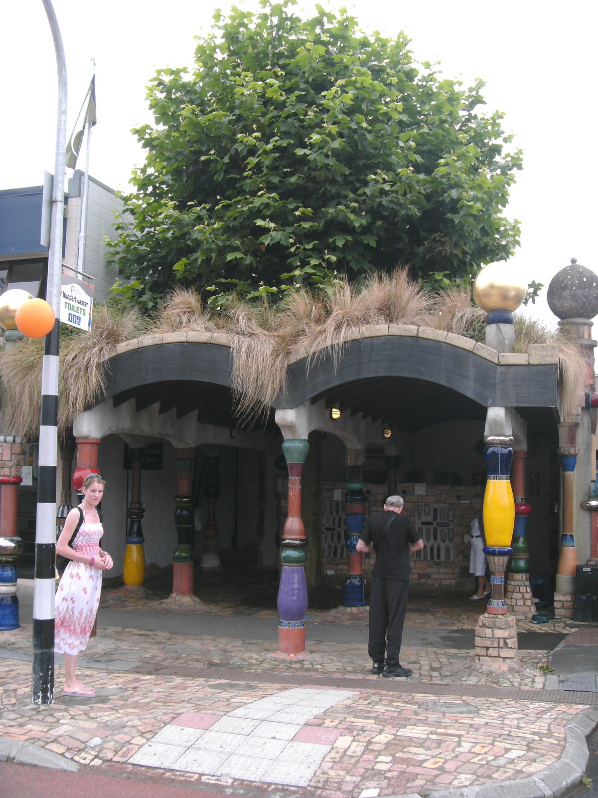
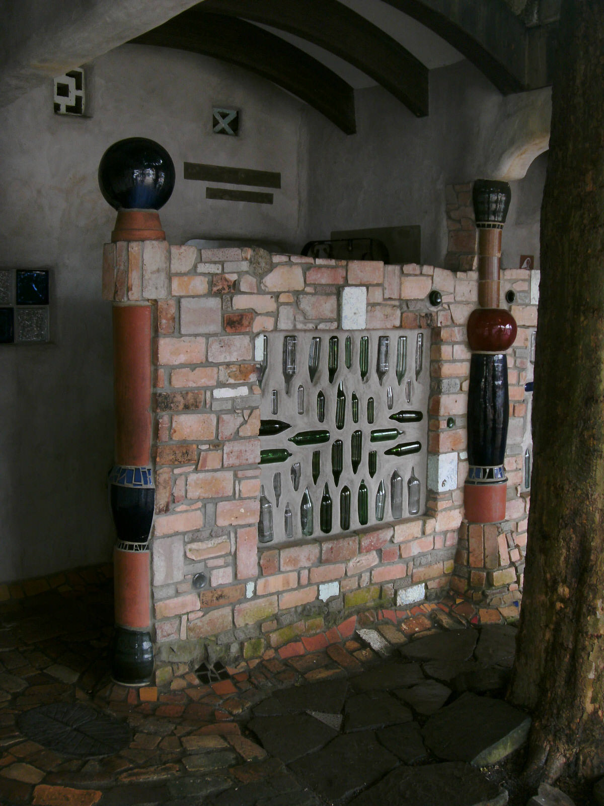
[raw]
[/raw]

Am nächsten Morgen – das Wetter leider so wie gestern – versprach die Wettervorhersage für ganz Neuseeland schlechtes Wetter…

Wir machten uns dann auf in die benachbarte Stadt Kerikeri . Nach einem ausführlichen Bummel durch die Stadt schauten wir noch in einer Holtzschnitzerei (Kauri Workshop) rein, die die Mammutbäume „Kauri“ und andere regionale Bäume verarbeitet. Wir machten auch bei einer kleinen Schokoladenfabrik und einer Winzerei halt  :) Die Schokolade und der Wein schmeckten sehr gut… Wir hatten also gute Alternativen für unseren eigentlichen Strandtag gefunden!

Durch nieselige Landschaften fuhren wir dann zu einem kleinen Kauri Forest und schauten uns die besagten Mammutbäume mal selbst an. Diese echt riesig großen Bäume, die mehrere tausende Jahre alt sind, waren echt beeindruckend und trotz Regen hat sich der Weg zu dem verlassenen Park gelohnt  :)

[raw]
[/raw]
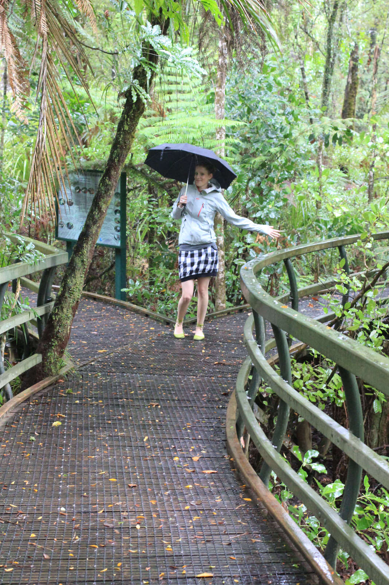
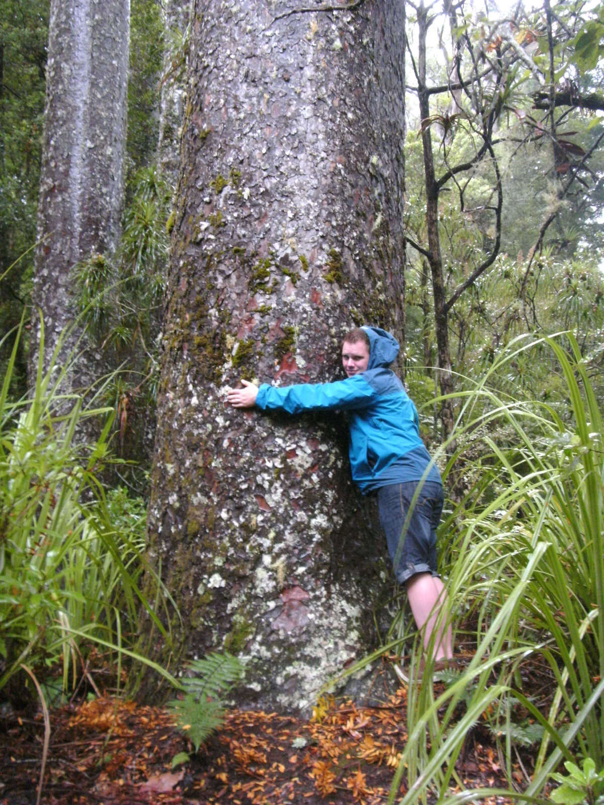
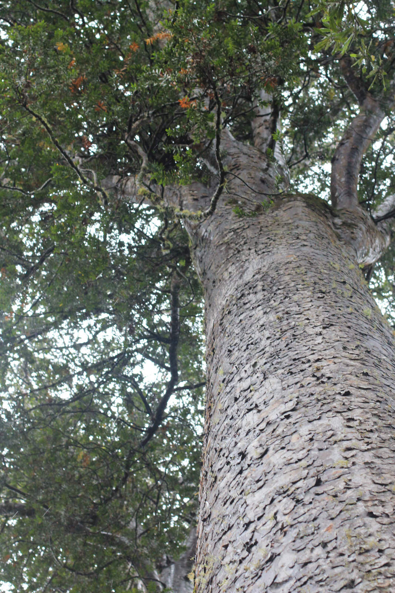
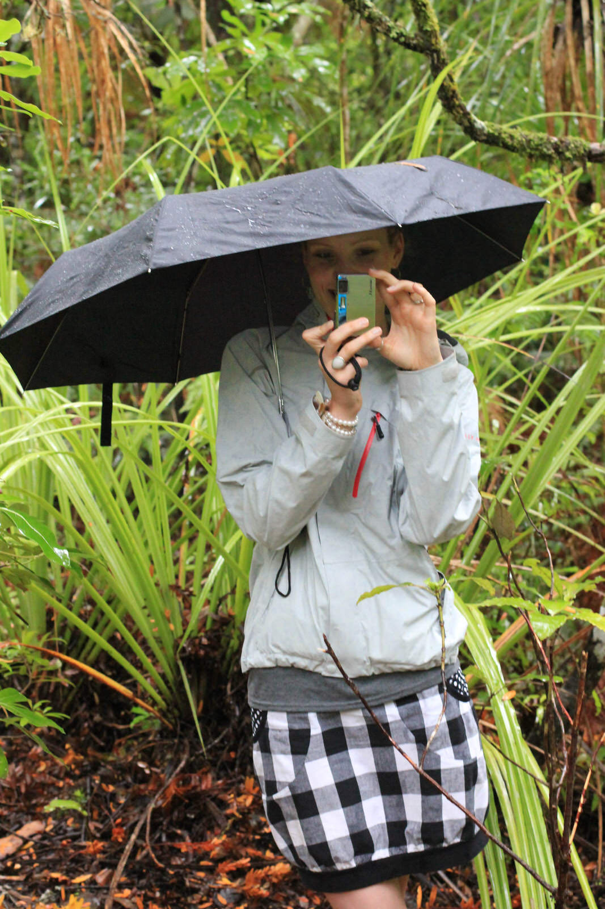
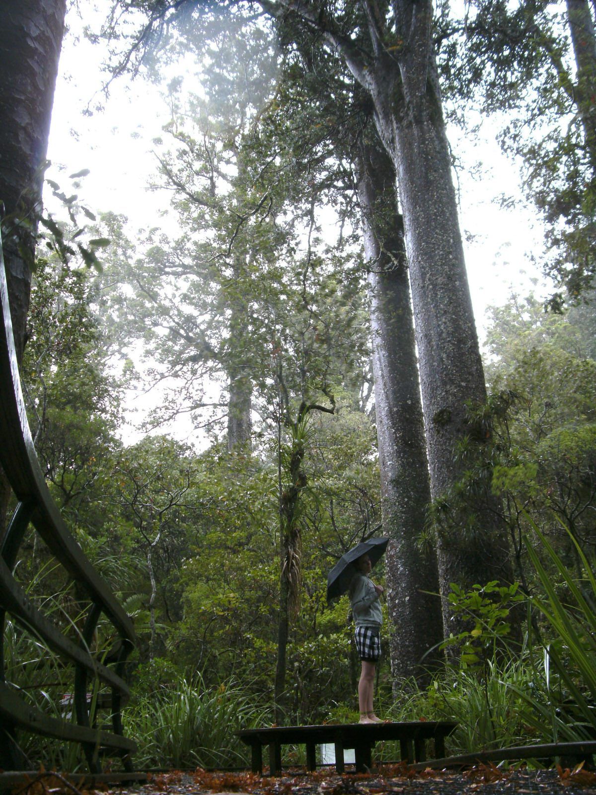
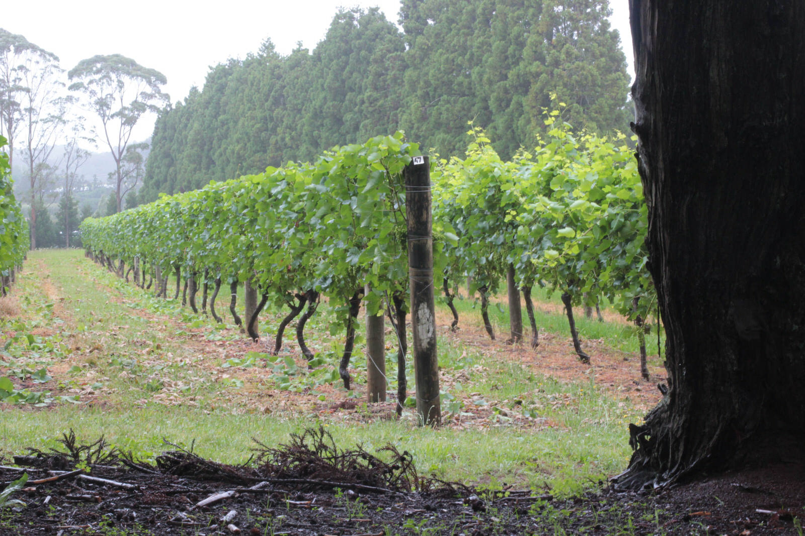
[raw]
[/raw]

Zu guter Letzt besuchten wir noch die historischen Waitangi Treaty Grounds. Ein Gelände, wo DER Vertrag zwischen Maori und Brithen geschlossen wurde, der die beiden Völker vereinte und der „Geburtsort“ Neuseelands ist…

[raw]
[/raw]
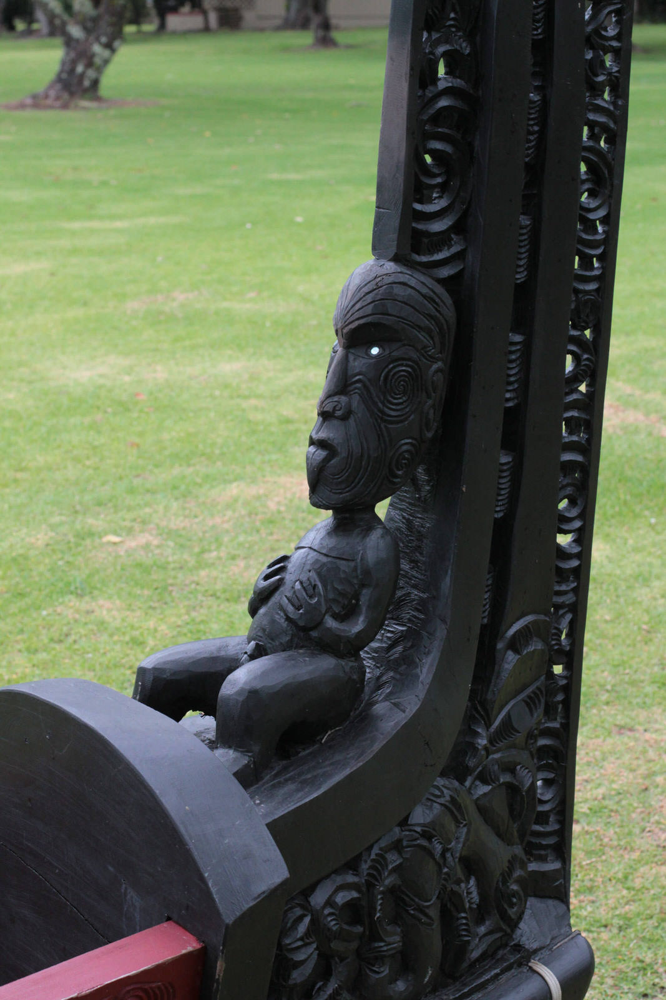
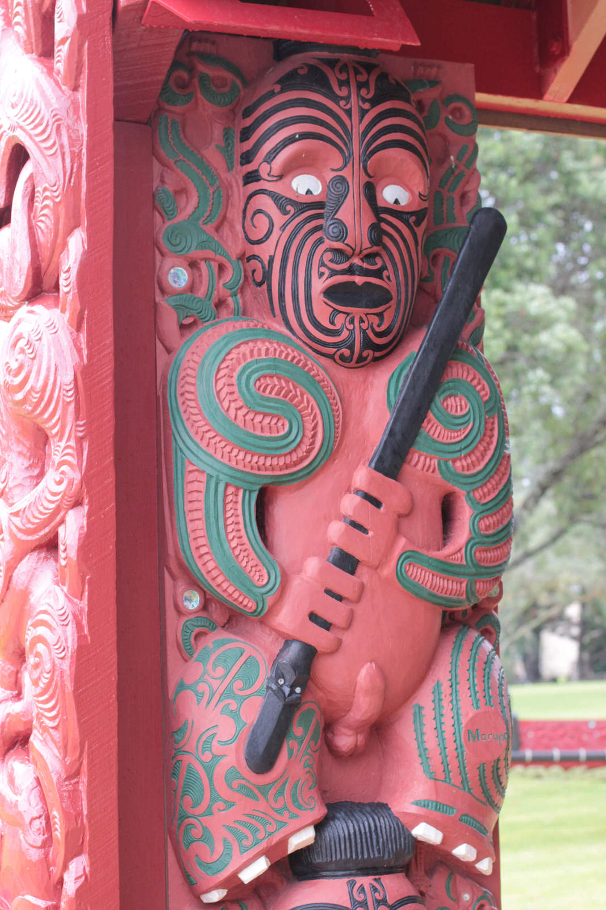

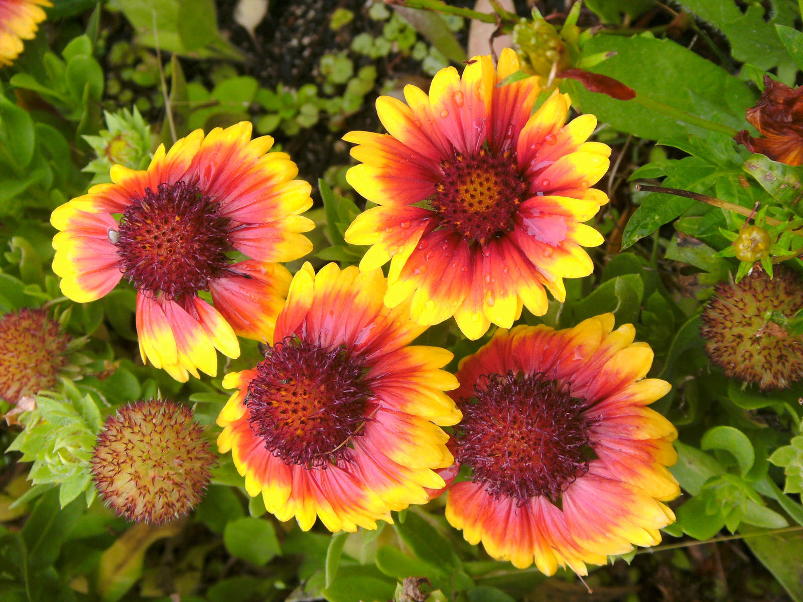
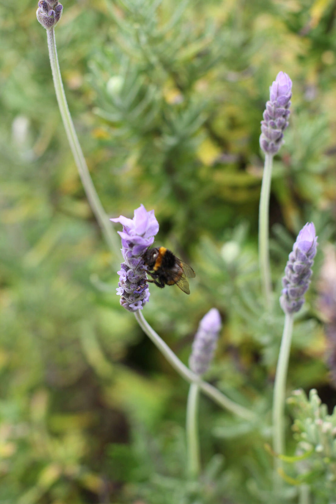
[raw]
[/raw]

