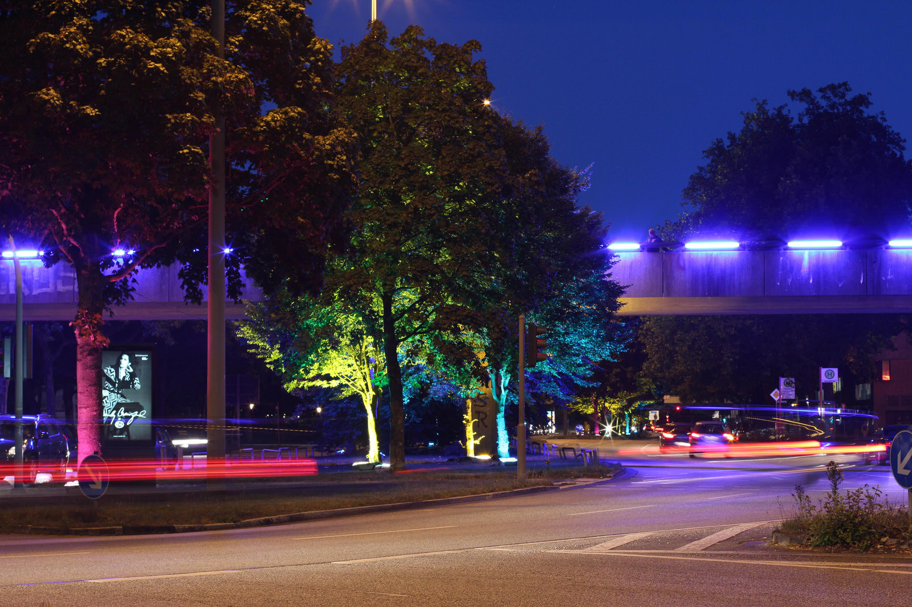
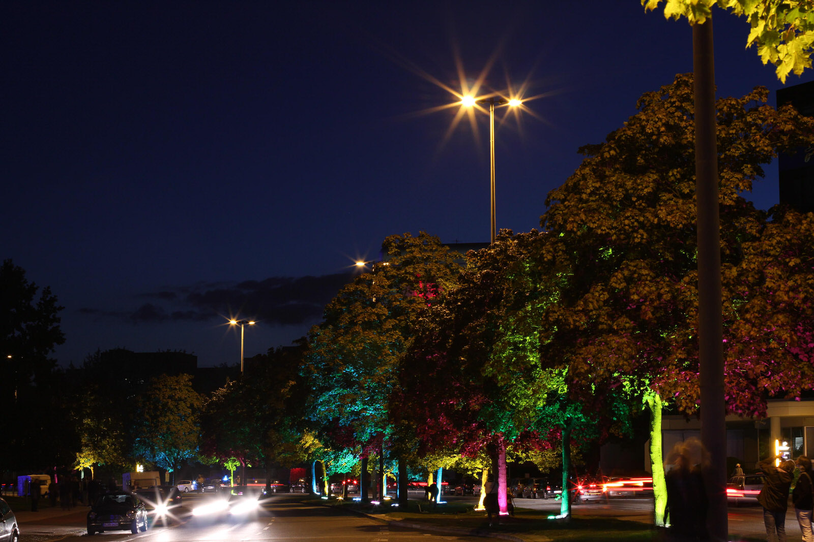
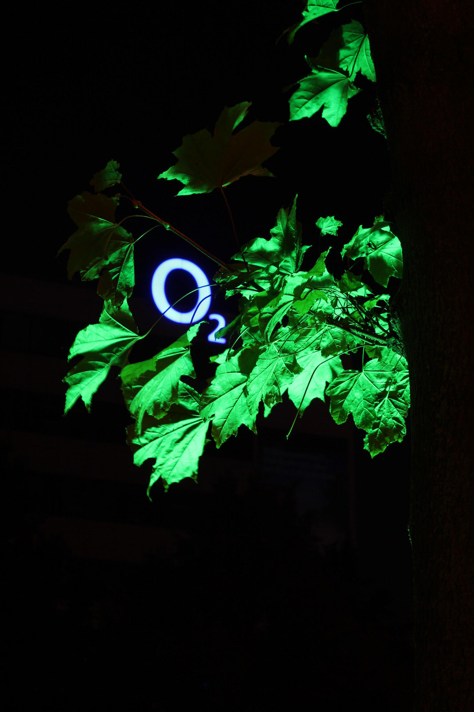
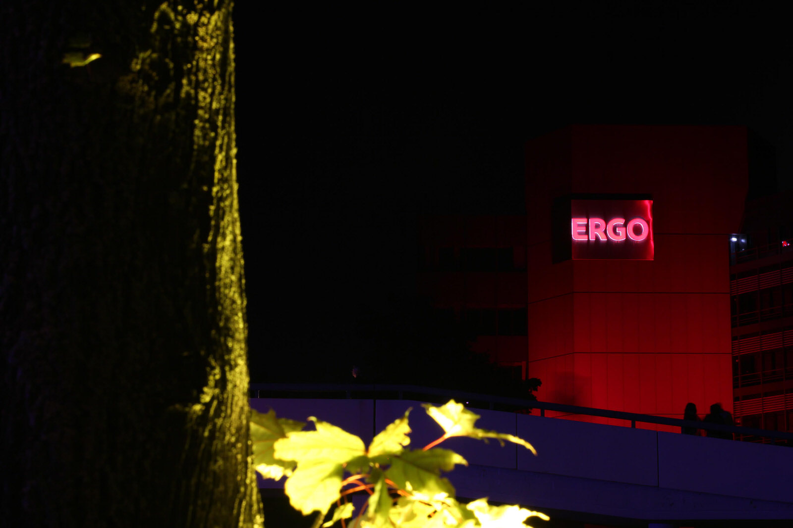
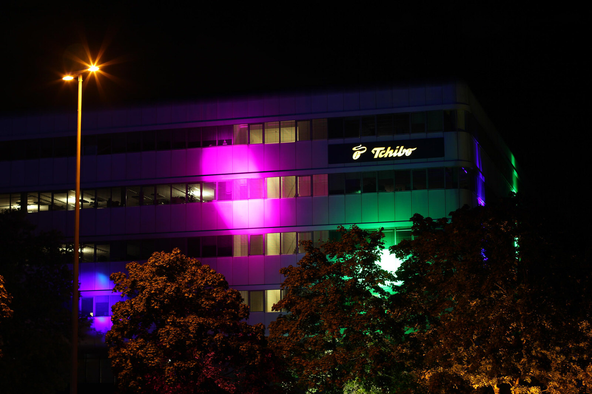
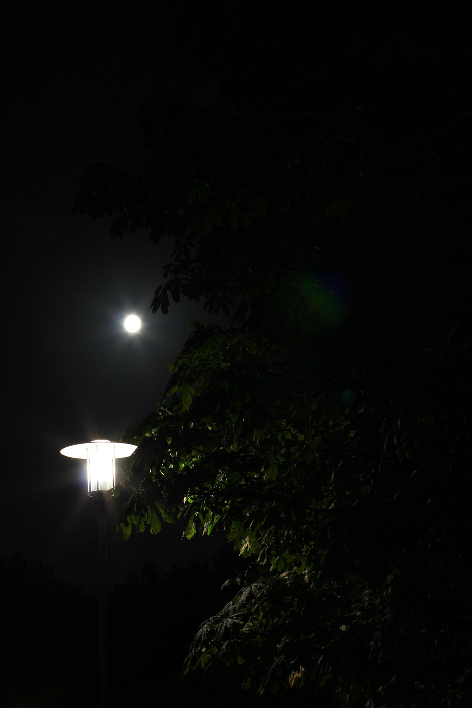
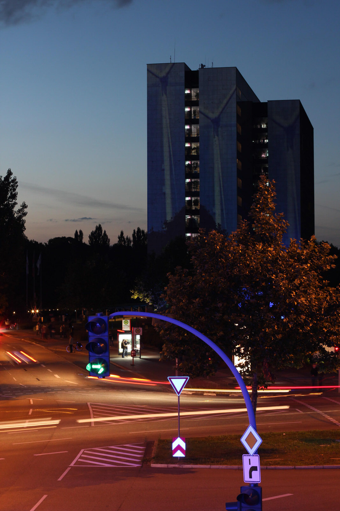

Am Wochenende war ich auf einer nächtlichen Fotoexkursion in der City Nord :) Dort werden jährlich die Bürogebäude in Szene gesetzt. Dies geschieht durch Projektionen oder aber auch Farblampen.

Die besten Bilder habe ich mit meinem "Smugmug Insert Plugin" einmal eingespielt...

[raw]
[/raw]

[raw]
[/raw]

