Anfang des Jahres haben Sandra, Sven, Denise und ich entschieden, dass wir in ein gemeinsames Urlaubs-Abenteuer verreisen möchten. Relativ schnell war klar ein Urlaub mit Camping-Wagen oder ähnlichem soll her. Nach Recherchen im Netz sind wir auf [Fluchtwagen.com](http://www.fluchtwagen.com/) gestoßen, die alte T4 nach eigenen Umbauten zur Vermietung anbieten.

Nachdem unser Fortbewegungsmittel fest stand, haben wir gemeinsam eine Route in den südöstlichen Teil Frankreichs geplant. 

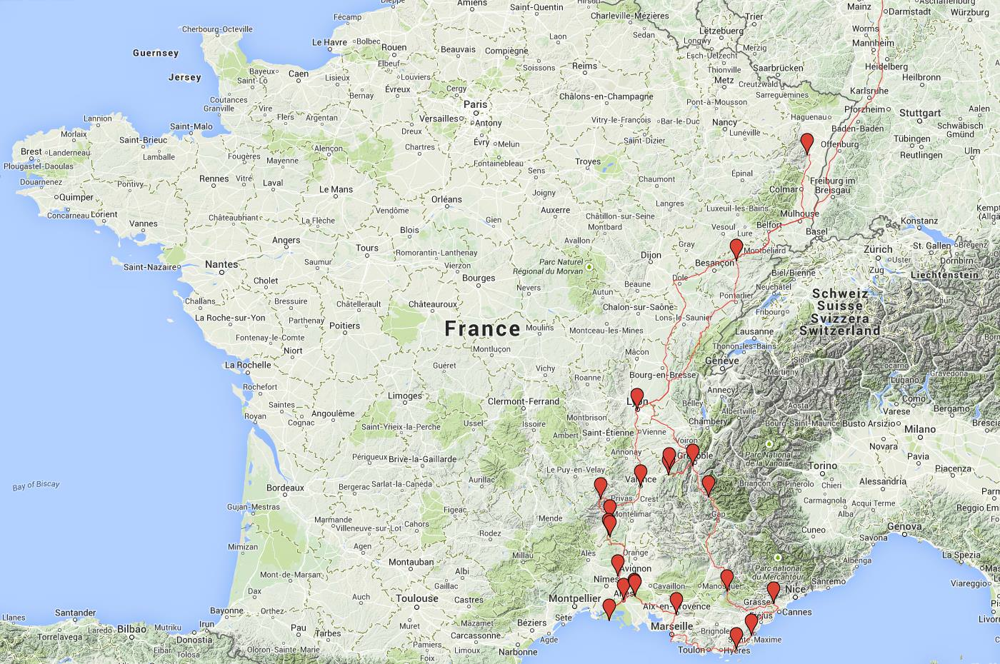

Ich möchte auch garnicht mehr schreiben, sondern die Bilder für sich sprechen lassen...

[raw]
[/raw]
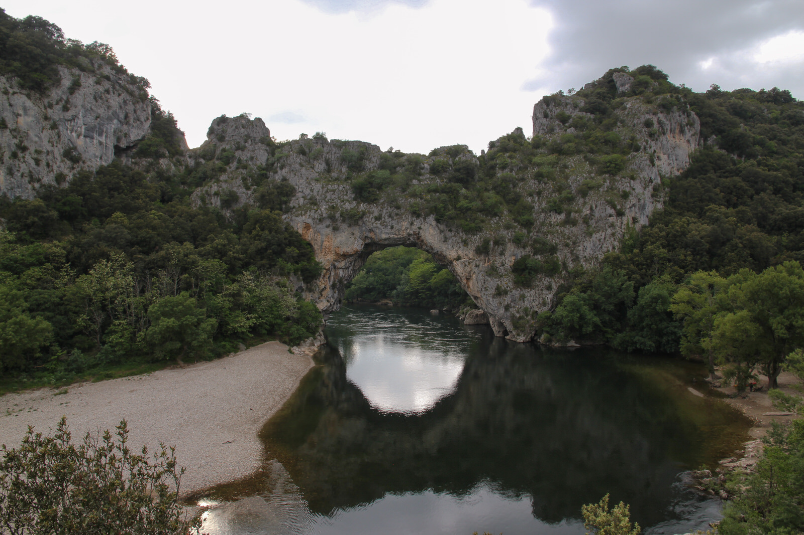
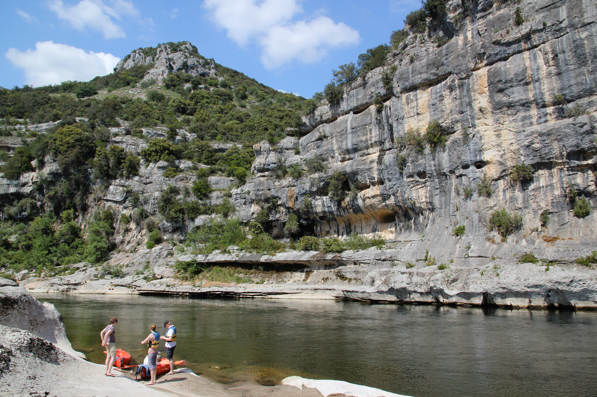
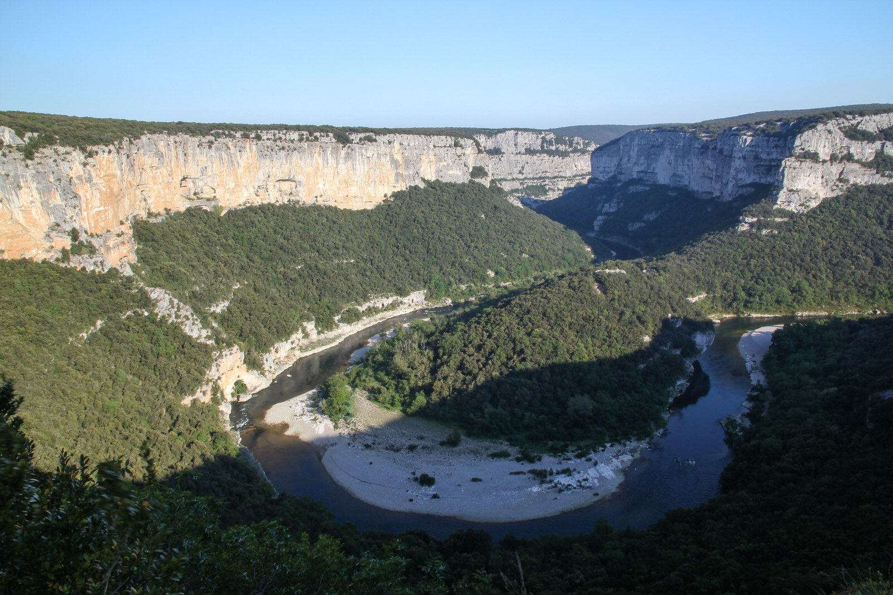
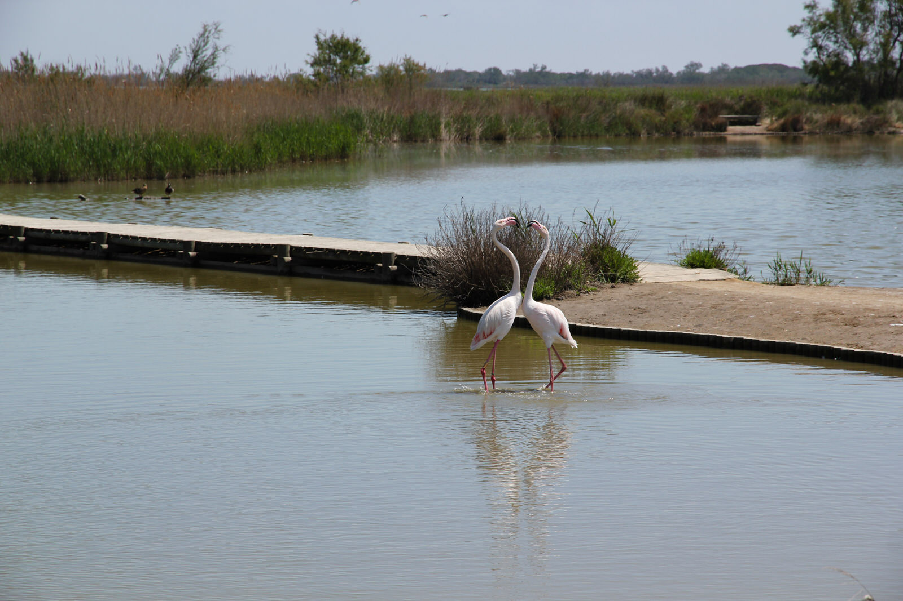
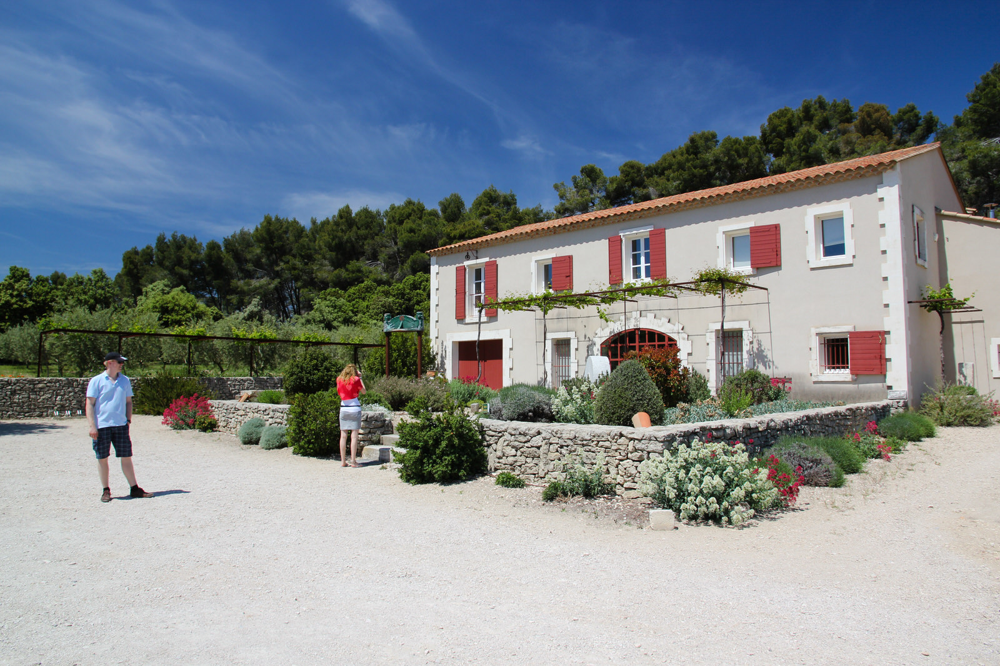
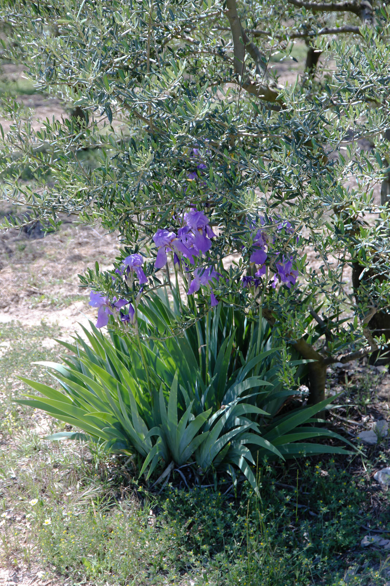
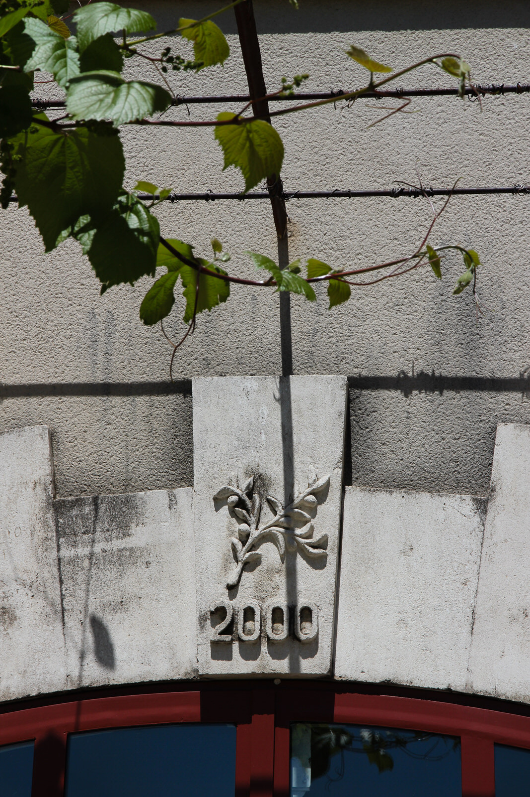
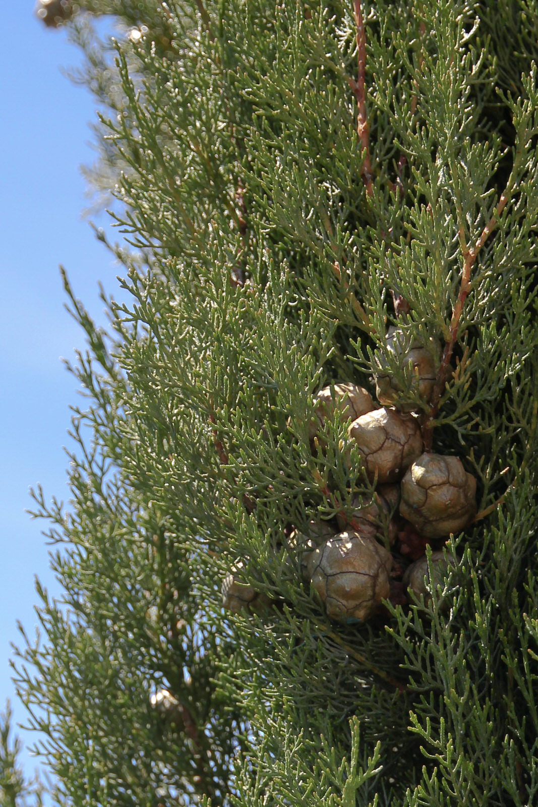
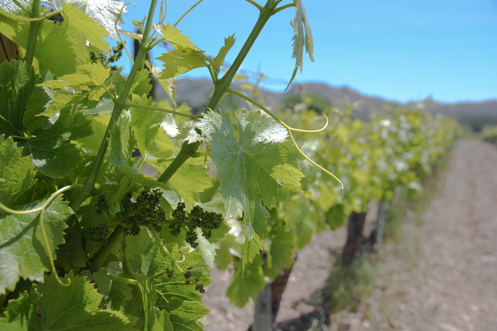
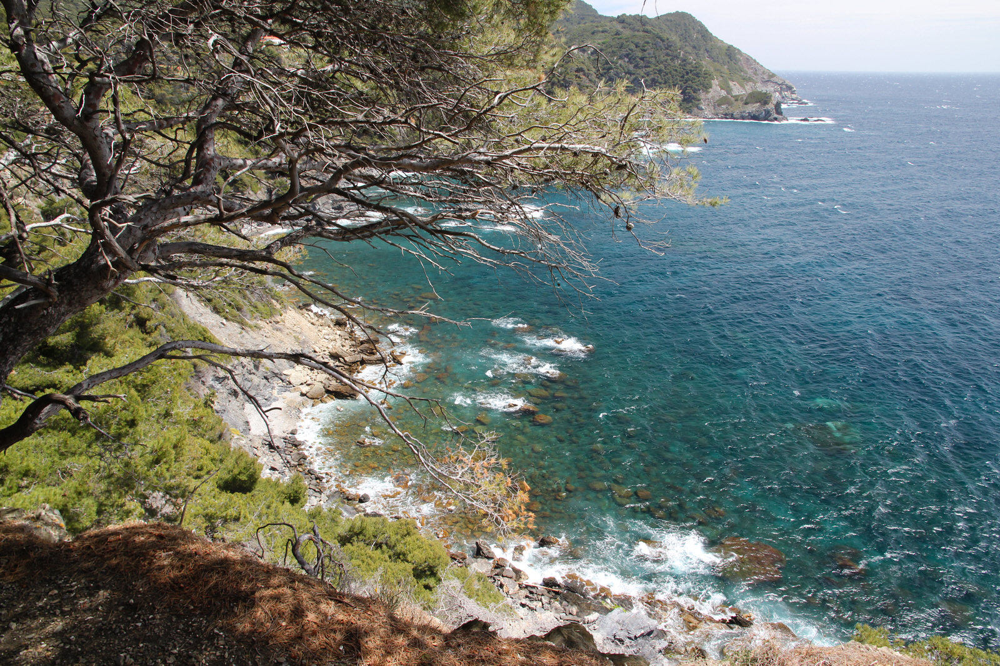
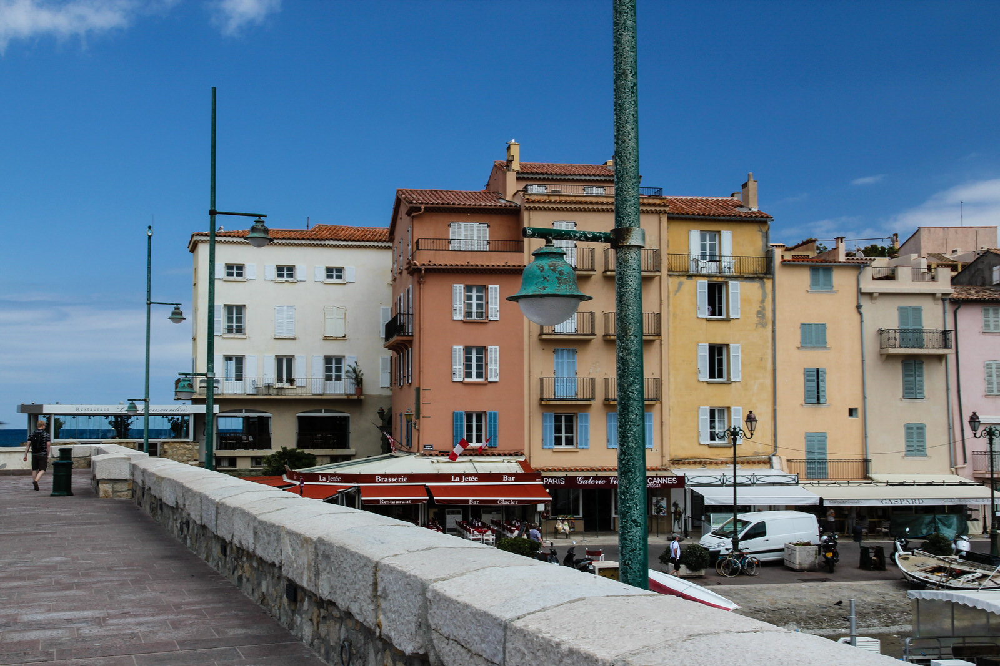
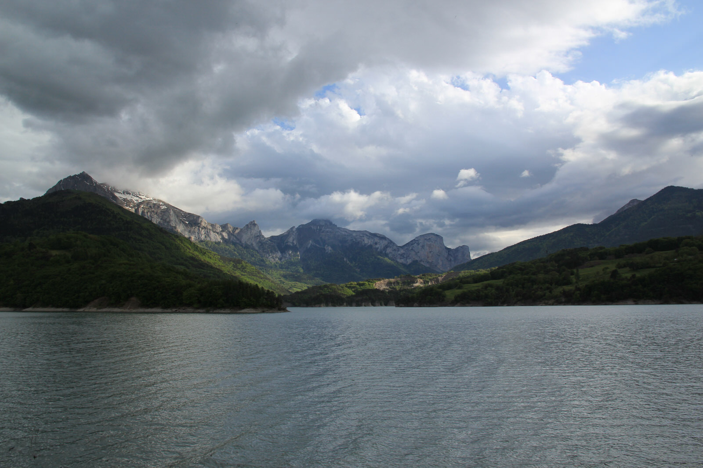
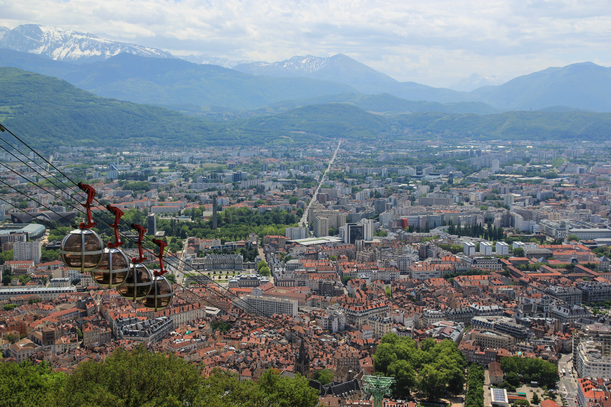
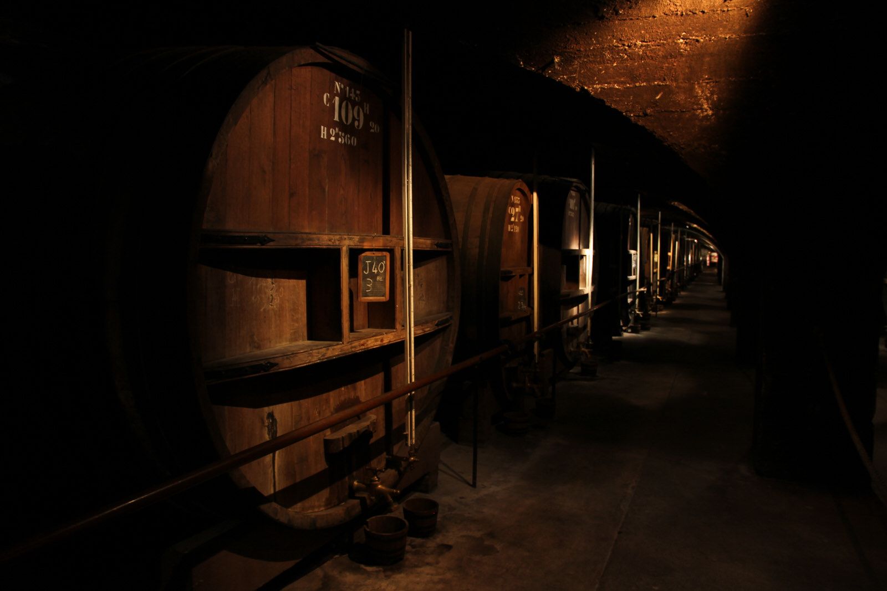
[raw]
[/raw]

Weitere Bilder gibt's wie immer auf meiner [SmugMug-Seite](http://melistik.smugmug.com/2012/Frankreich/)
