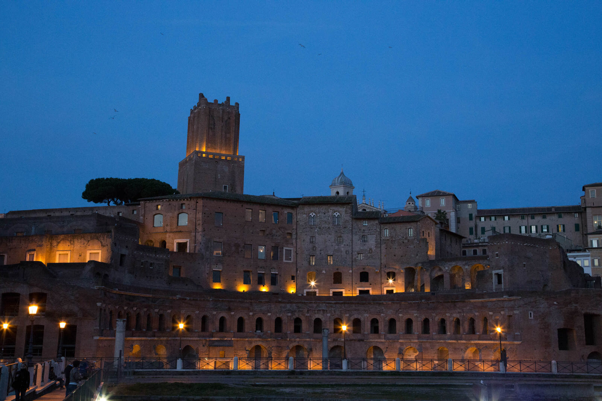

Durch ein Seminar für das Webframework Vaadin bin ich nach Rom gereist. Glücklicherweise konnte ich meinen Rückflug um 2 Tage verschieben, wodurch ich auf eigene Faust das schöne Rom erkunden konnte. Ausgestattet mit meiner neuen Kamera verblieben mir 2 Abende, 1 voller Tag und ein kurzer Vormittag bevor ich die Heimreise antreten musste. Am ersten Abend erkundete ich den Platz rund um das Kolosseum. Da dieses leider am frühen Abend schließt,entschied ich mich den nächsten morgen gleich früh dieses erneut zu besuchen.

[raw]
[/raw]

[raw]
[/raw]

Für meinen vollen, sonnigen Samstag nahm ich mir vor die Stadt zu Fuß zu erkunden.
Sonnig - ja das Wetter (19°) war herrlich und nicht mit dem Hamburger Schneeriesel zu vergleichen...

So machte ich mich im Poloshirt langer dünnen Hose auf die schönsten Fotomotive Roms zu finden. Welche zahlreichen Gebäude  und schönen Plätze ich auf meiner Erkundung entdeckte möchte ich nun nicht aufzählen, sondern vielmehr die Fotos für sich sprechen lassen...

[raw]
[/raw]

[raw]
[/raw]

Den Franz (ich meine "Franziskus I" :) ) habe ich zwar nicht am Petersdom getroffen, dafür aber den abenteurlichen Aufstieb zur Domkuppel mitgemacht. Oben von der Kuppel der Basilika konnte man über die großartige Stadt schauen. Leider sind meine Panoramos nicht sooo gut geworden, wie mir der Ausblick in der Erinnerung geblieben ist...

[raw]
[/raw]

[raw]
[/raw]

Vom Petersdom machte ich mich in den nordwestlichen Teil von Rom auf...

[raw]
[/raw]

[raw]
[/raw]

Ein, wie ich finde, super schönes Panorama ist mir kurz vor Sonnenuntergang am "Fori Imperiali" geglückt

[raw]
[/raw]

[raw]
[/raw]

Das wars aus Rom ;) Ich hatte jedenfalls jede Menge Spaß und eine Foto-Exkursions-Tour durch eine neue Stadt ist zwar sehr anstrengend - zumindest zu Fuß - hat sich aber auf jedenfalls gelohnt.

Mehr [Fotos](http://melistik.smugmug.com/2013/Rom/) und eine [Karte](http://maps.smugmug.com/?feedType=geoAlbum&Data=28569700_dKHkKB) findet ihr auf Smugmug...
