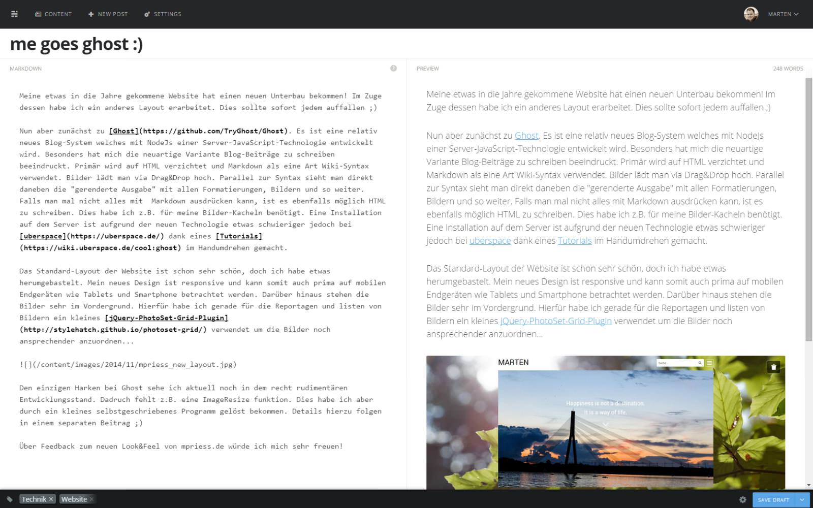

Meine etwas in die Jahre gekommene Website hat einen neuen Unterbau bekommen! Im Zuge dessen habe ich ein anderes Layout erarbeitet. Dies sollte sofort jedem auffallen ;)

Nun aber zunächst zu [Ghost](https://github.com/TryGhost/Ghost). Es ist eine relativ neues Blog-System welches mit NodeJs einer Server-JavaScript-Technologie entwickelt wird. Besonders hat mich die neuartige Variante Blog-Beiträge zu schreiben beeindruckt. Primär wird auf HTML verzichtet und Markdown als eine Art Wiki-Syntax verwendet. Bilder lädt man via Drag&Drop hoch. Parallel zur Syntax sieht man direkt daneben die "gerenderte Ausgabe" mit allen Formatierungen, Bildern und so weiter. Falls man mal nicht alles mit  Markdown ausdrücken kann, ist es ebenfalls möglich HTML zu schreiben. Dies habe ich z.B. für meine Bilder-Kacheln benötigt. Eine Installation auf dem Server ist aufgrund der neuen Technologie etwas schwieriger jedoch bei [uberspace](https://uberspace.de/) dank eines [Tutorials](https://wiki.uberspace.de/cool:ghost) im Handumdrehen gemacht.

Das Standard-Layout der Website ist schon sehr schön, doch ich habe etwas herumgebastelt. Mein neues Design ist responsive und kann somit auch prima auf mobilen Endgeräten wie Tablets und Smartphone betrachtet werden. Darüber hinaus stehen die Bilder sehr im Vordergrund. Hierfür habe ich gerade für die Reportagen und listen von Bildern ein kleines [jQuery-PhotoSet-Grid-Plugin](http://stylehatch.github.io/photoset-grid/) verwendet um die Bilder noch ansprechender anzuordnen...

Den einzigen Harken bei Ghost sehe ich aktuell noch in dem recht rudimentären Entwicklungsstand. Dadruch fehlt z.B. eine ImageResize funktion. Dies habe ich aber durch ein kleines selbstgeschriebenes Programm gelöst bekommen. Details hierzu folgen in einem separaten Beitrag ;)

Über Feedback zum neuen Look&Feel von mpriess.de würde ich mich sehr freuen!
