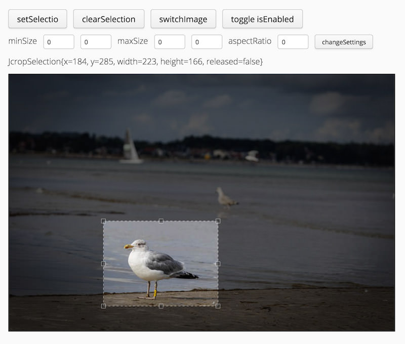

Es ist soweit ich habe mein erstes Vaadin-Addon veröffentlicht :) 
Vor knapp 2 Jahren begann alles mit einem Vaadin-Training in Rom. Ihr erinnert euch vielleicht an meine [Bilder aus Rom](/bella-italia-40h-in-rom/). 

**JCrop-Wrapper** heißt das Addon und es ist auf der [Vaadin-Seite](https://vaadin.com/directory#addon/jcrop-wrapper) einfach auffindbar. Es ermöglicht das einfache einbinden einer Komponente zum festlegen von Bildausschnitten. Durch die Veröffentlichung habe ich nun auch meine erste praktische Berührung mit [Github](https://github.com/melistik/vaadin-jcrop) gemacht. Schaut es euch gerne selbst an oder [probiert es aus](http://non-rocket-science.jelastic.servint.net/vaadin-jcrop/)!
