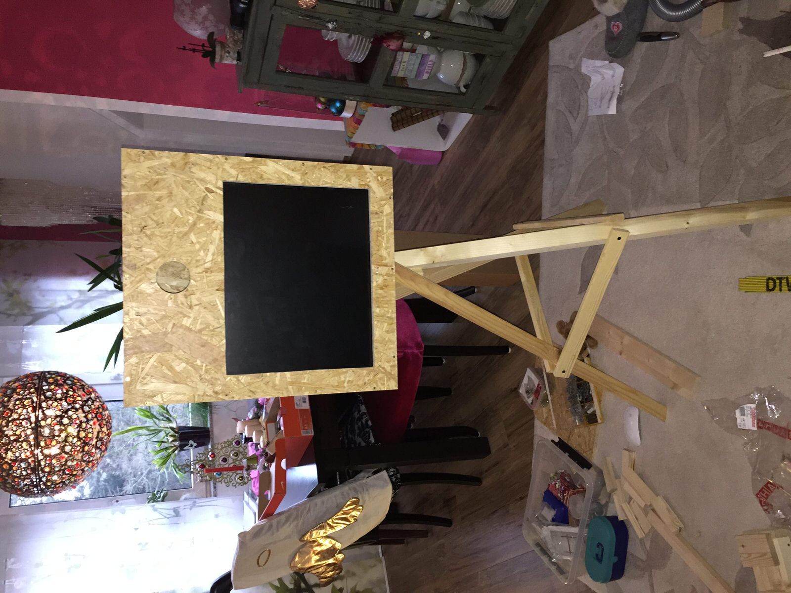
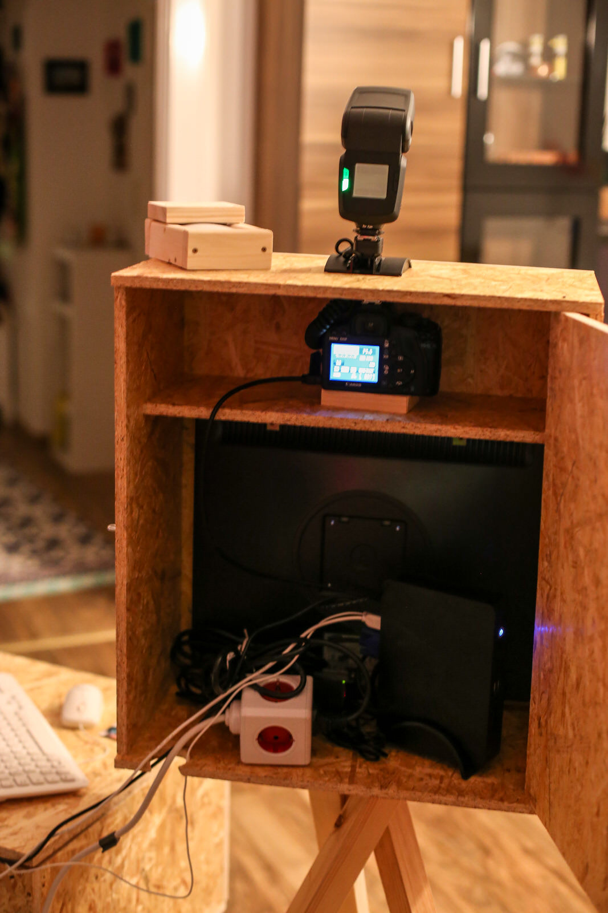
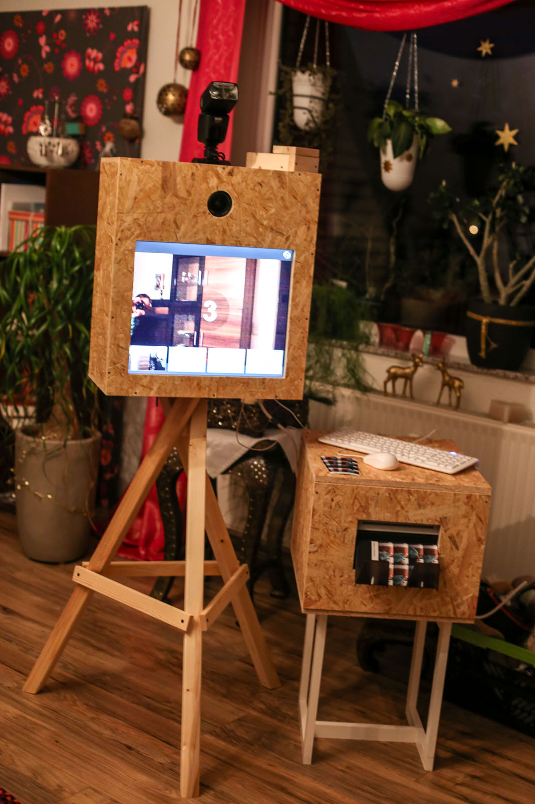
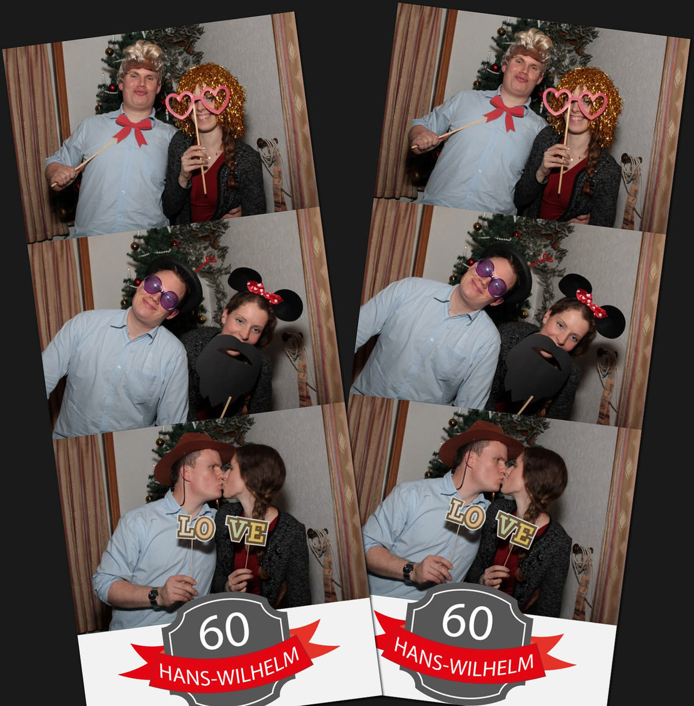

Eine Fotobox erzeugt auf einer Party ihren ganz besonderen Reitz. Vorallem als Fotografie-Interessierter und *"Computer-Freak"* zieht einen dieses Zusammenspiel in seinen Bann. Ende letzten Jahres entschied ich mich für die Geburtstagsfeier meiner Vaters solch ein Gerät selbst zu bauen. Natürlich hatte ich die ausstehende eigene Hochzeit und zahlreiche Einladungen im Hinterkopf :)

Also durchstöberte ich mein Computer-Teile-Fundus und recherchierte im Internet bezüglich des Eigenbaus einer solchen Maschiene. Einen alten 19 Zoll TFT befand sich noch auf dem Dachboden und vor kurzen hatte ich mein selbstgebautes NAS (bestehend aus einem NanoPc mit Intel Atom und 4Gb Ram) gegen eine Synology-Lösung ersetzt. Somit hatte ich bereits die wesentlichen Komponenten für die reine Technik.

Als Kamera dient zunächst meine eigene Canon 6D, wobei diese später durch eine Leihgabe von Laura zu gunsten der Möglichkeit eigene Fotos zeitgleich schießen zu können ersetzt wurde. Zu guter Letzt fehlte noch ein Blitz in meinem Equipment, so dass ich mir das [mecablitz 52 AF-1](https://www.metz.de/de/blitzgeraete/produktfamilien/system-blitzgeraete/mecablitz-52-af-1-digital/produktbeschreibung.html) von Metz anschaffte.

Nachdem ich die Grundausrüstung zusammen hatte macht ich mich an den eigentlich Bau der Holzkiste (ein weiteres Hobby von mir).

[raw]
[/raw]

[raw]
[/raw]

Für die Software [dslrBooth-Photo-Booth](http://dslrbooth.com) entschied ich mich sehr schnell, da Sie die freie Gestaltung des Drucklayout ermöglicht und sonst auch hervorragend mit dir Kamera agiert. Auch ein Live-Bild vor der Fotoauslösung ist möglich. Der Start zur Fotoerstellung erfolgt mittels Maus (geplant war/ist eine schönere Alternative - RoterButton o.ä.)

Abgerundet wird das Photo-Booth-Erlebnis durch einen hierfür angeschafften "Thermo-Drucker", der auch in Drogerie-Märke als Sofortdrucker eingesetzt wird. Hier habe ich mich für den Drucker [DNP DS-RX1](http://www.dnpphoto.eu/de/produkte/fotodrucker/ds-rx1) entschieden, da er das zerschneiden von Fotos im Stil eines Fotostreifens unterstützt und relativ preiswert ist. In den Druckeinstellungen kann man hinterlegen ob bei 4x6 Zoll-Fotos normal oder doppelt geschnitten werden soll - sehr praktisch ;) ebenso ist glossy oder matt wählbar ohne hierfür das Papier zu wechseln.

Ob Jung ob Alt auf der Feier wurde der Kasten rege genutzt und mein Vater konnte sich im Anschluss an den ungewöhnlichen Fotos seiner Gäster erfreuen... Somit war die erste Bewährungsprobe geglückt :)

----

Beim Ersteinsatz sind mir einige Dinge aufgefallen, die noch zu optimieren waren. Darüber hinaus stand noch ein Anstrich an um den Kasten etwas ansehnlicher zu machen und für seine Langlebigkeit zu sorgen ;)

So vergrößerte ich den Abstand oberhalb der Kamera durch eine neue  Ausbuchtung und weitete das Objektiv-Loch da dies etwas zu knapp bemessen war. Zu guter Letzt befestigte ich den NanoPc mit seiner Vesa-Kalterung an der Monitor-Rückseite (diese hatte ich zufällig gefunden), so dass dieser nicht mehr hin unter her wackeln konnte und etwas mehr Platz im Innerin vorhanden wurde.

In Photoshop erstellte ich mir eine etwas kreativere Fotostreifen-Vorlage, die die Bilder mit einem Rahmen und etwas
