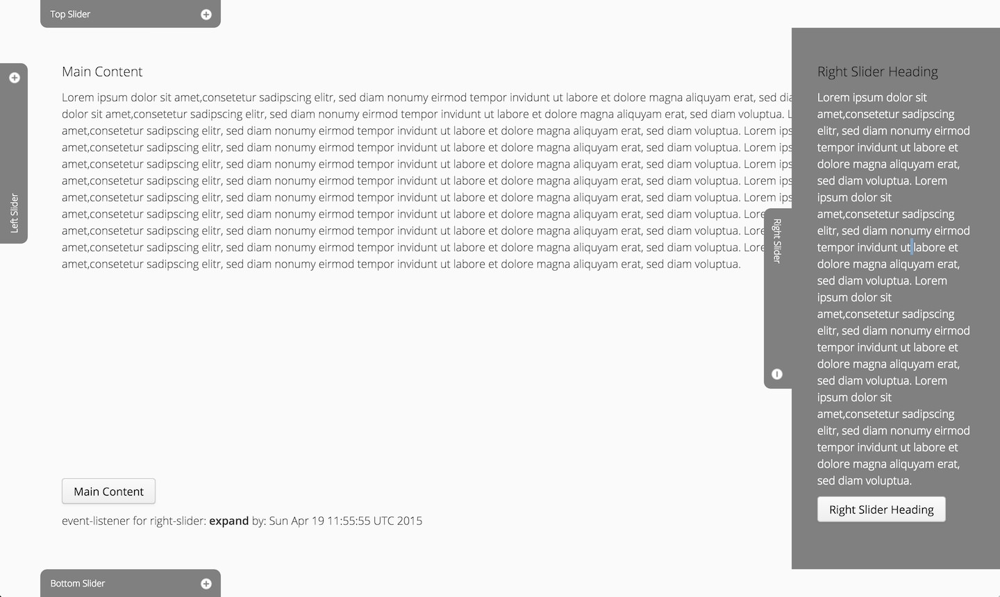
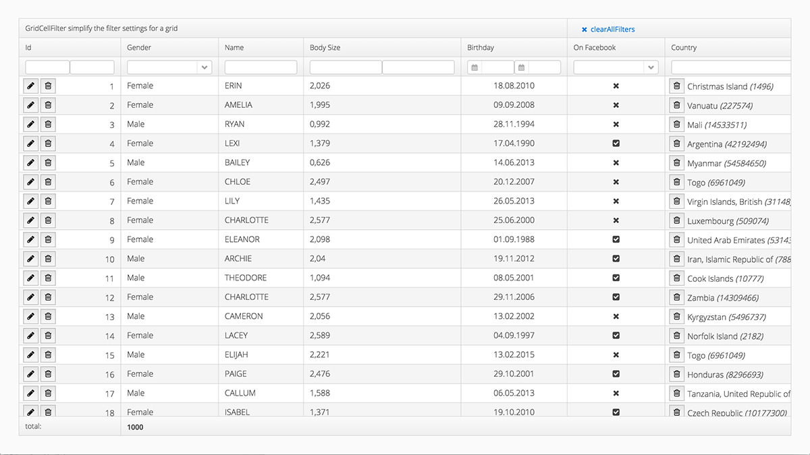

Nach dem ersten [JCrop-Wrapper](/first-vaadin-addon/) Addon wollte ich noch eine GWT-Erweiterung schreiben, die eine häufig gewünschte aber nicht vorhandene Komponente realisiert. Ein Slidable-Panel welches sich im ausgeklappten Modus über den Inhalt legt. Dies wird häufig für Filter-Bereich oder ähnliches verwendet.  

**SliderPanel** heißt das Addon und es ist auf der [Vaadin-Seite](https://vaadin.com/directory#!addon/sliderpanel) einfach auffindbar. Schaut es euch gerne selbst an oder [probiert es aus](http://non-rocket-science.jelastic.servint.net/vaadin-sliderpanel/)!

Schön ist das Feedback welches ich durch die Veröffentlichung erhalten habe. Bereits nach 3 Wochen hat die Erweiterung über 300 Downloads erreicht und 13 Bewertungen :)

Die Resonanz des SliderPanel's und die erste intensive Verwendung des Grids hat mich dann dazu bewogen ein weiteres Addon zu entwickeln. Das **GridUtil** vereinfacht die Verwendung des mit Vaadin 7.4 veröffentliche Grids. Es erlaubt auf einfache Weise einen Suchzeile unterhalb der Titel-Spalten hinzu zu fügen und enthält auch sehr nützliche Renderer.

Der Link zum [GridUtil im Directory](https://vaadin.com/directory#!addon/gridutil) und der [Demo-Applikation](http://non-rocket-science.jelastic.servint.net/vaadin-grid-util/)
