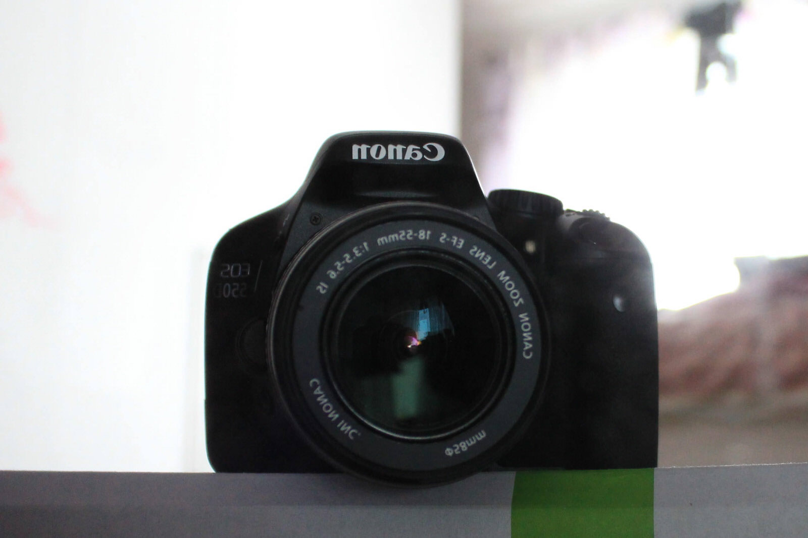
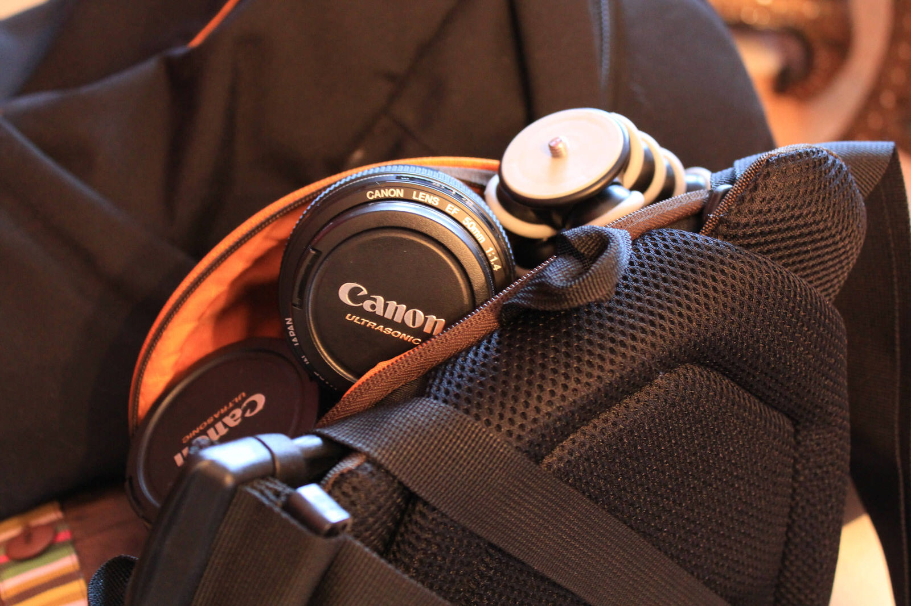
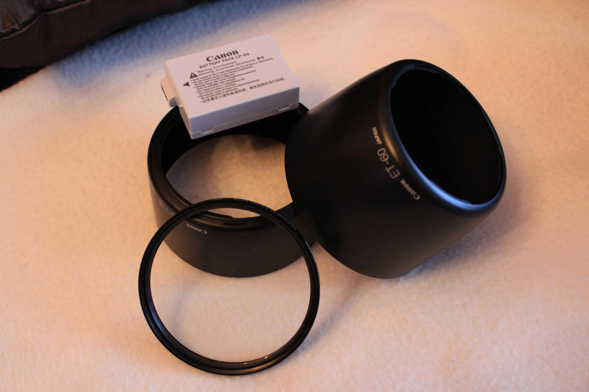

Heute möche ich euch einen kurzen Überblick zu meinem Foto-Equipment geben :) Auch als Vorbereitung für Neuseeland damit ich nichts vergessen habe... Grundsätzlich neben meiner Canon EOS-550D habe ich noch ein paar Objektive und nützliche Helferlein die ich gerne vorstellen möchte.

[raw]
[/raw]

[raw]
[/raw]

* Canon EOS-550D
  * Bin super mit der Kamera zufrieden. Biete zahlreiche Funktionen die meine alte Olympus E-410 nicht hatte. Das super Display mit 1 MegaPixel Bildpunkten ist der Knaller und die Full-HD-Videos rocken...
  
* EF-S 18-55mm 1:3.5-5.6 IS
  * War beim Kamerakauf dabei aber ist nicht so dolle und hätte ich mir auch sonst nicht so gekauft... Der Qualitätsunterschied zu meinen anderen Objektiven ist doch sehr groß und daher nutze ich das Objektiv nahezu nie.
  
* EF 28-135mm 1:3.5-5.6 IS USM
  * Hab ich günstig bei Ebay geschossen, doch leider ist der Bildstabilisator recht laut und für ein Zoom-Objektiv ist es mir leider in häufigen Situationen doch zu wenig Zoom...
  
* EF-S 55-250mm 1:4-5.6 IS
  * Dieses Objektiv habe ich mir nach dem 28-135 geholt um den Zoombereich noch zu vergrößern. Mit dem Preisleistungsverhältnis des Objektives bin ich sehr zufrieden
  
* EF 50mm 1:1.4 USM
  * Meine erste und sicherlich nicht letzte Festbrennweite. Ich bin von der Lichtstärke und Bildschärfe total begeistert und mache sehr viele available Light Aufnahmen mit dem Objektiv. Dieses Objektiv ist eigentlich immer in meiner Jimmy Bo Tasche :)

* Crumpler Taschen
  * Jimmy Bo die total praktische Tasche wenn man unterwegs ist und nicht super viel rumschleppen möchte. In den großen Rucksack passt das komplette Equipment jedoch ist die Tasche auch recht groß und auf längeren Touren lästig...
* Sonstiges Zubehör
  * Neben 2 Schutzfiltern besitze ich auch noch einen Skyline-Filter, den ich aber bisher noch nicht so richtig testen konnte... In Neuseeland ergeben sich dafür sicherlich aber viele Gelegenheiten :) Einen Infrarotauslöser habe ich mir mal für Fotos zu Zweit angeschafft und bei iBood gab es mal schnelle 8Gb SD-Karten sodass ich nun 3 Stück habe ;) hoffentlich reichen die für Neuseeland :P

* iPhone-App GeotagPhotos Pro
  * Ein super praktisches Geotagging-Tool welches aufgrund der iPhone-Speichergröße nahezu unbegrenzte Mengen an Geodaten aufzeichnen kann. Die Routen können dann auf die Plattform des Betriebers hochgeladen und gesichert werden. Die geschossenen Fotos werden anschließend mit einer einfachen WebStart-Java-Anwendung kinderleicht mit Geokoordinaten versehen... Ich finde diese Vorgehensweise deutlich einfacher und schneller als die altbewährten Geotagger mit propretären Schnittstellen und Tools... Man muss nichts spezielles installieren oder der gleichen.
  

