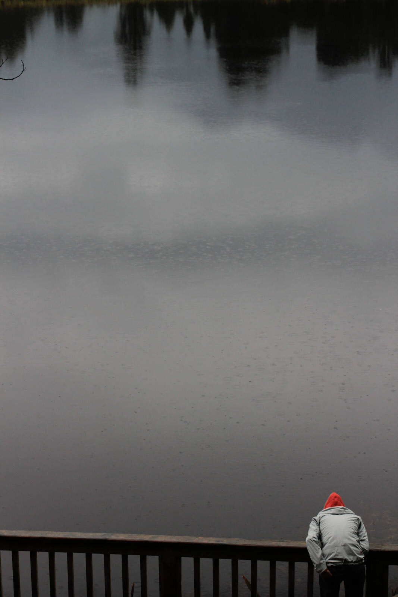
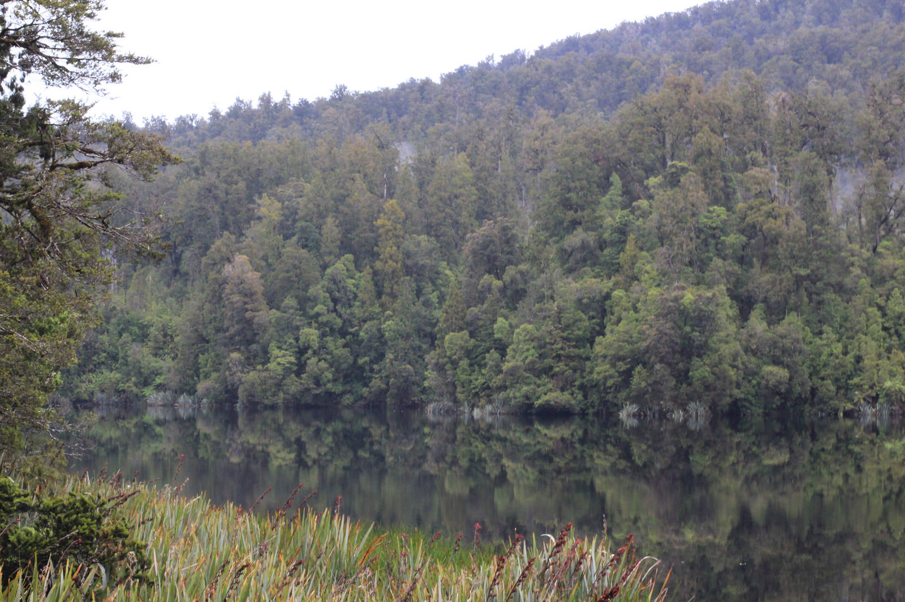
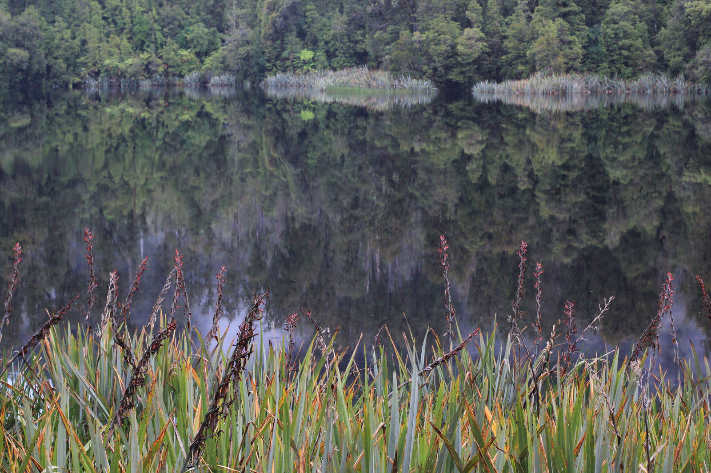

Nun geht es nur noch zu Zweit weiter. Nahne fliegt morgen von Christchurch nach Australien und erkundet das Nachbarland… Wir machten uns auf zum Fox Gletscher.
Nach 5 Stunden kurvenreicher Fahrt freuten wir uns schon riesig auf diese einmalige zuvor gebuchte Gletscherwanderung! Doch leider wurde diese aufgrund von Gesteinsrutschungen aufgrund des vielen Regens der letzten Tage gecanceled. Ausweichexkursionen am Franz Josef Gletscher (20Km entfernt) waren leider schon ausgebucht… Tja, so konnten wir leider eines unser Highlights unserer Neuseelandreise nicht machen. :(

Total enttäuscht fuhren wir dann mit dem Auto zum Gletscher, um wenigstens einen kleinen Blick aus der Ferne von dem Gletscher erhaschen zu können. Doch ohne Guide kam man nicht wirklich nah an den Geltscher heran, sodass uns nur noch der angeblich wunderschöne Blick über den Lake Matheson für den nächsten Morgen übrig bleibt.
Dann soll sich der Mount Cook wunderschön im See spiegeln. Wir werden sehen, doch leider sind wir viele Stunden umsonst gefahren, denn ansonsten kann man hier nicht viel Anderes unternehmen. Die Dörfer hier sind auch nicht wirklich groß und wir haben alles in ein paar Minuten gesehen…
Wollen wir hoffen, dass uns auf den nächsten Stationen nicht mehr so viel Pech verfolgt…

Hier noch ein kurzer Nachtrag... am Abend liefen wir noch zum Lake Matheson - der berüchtigt für seine Wasserspiegellungen ist...

[raw]
[/raw]

[raw]
[/raw]
