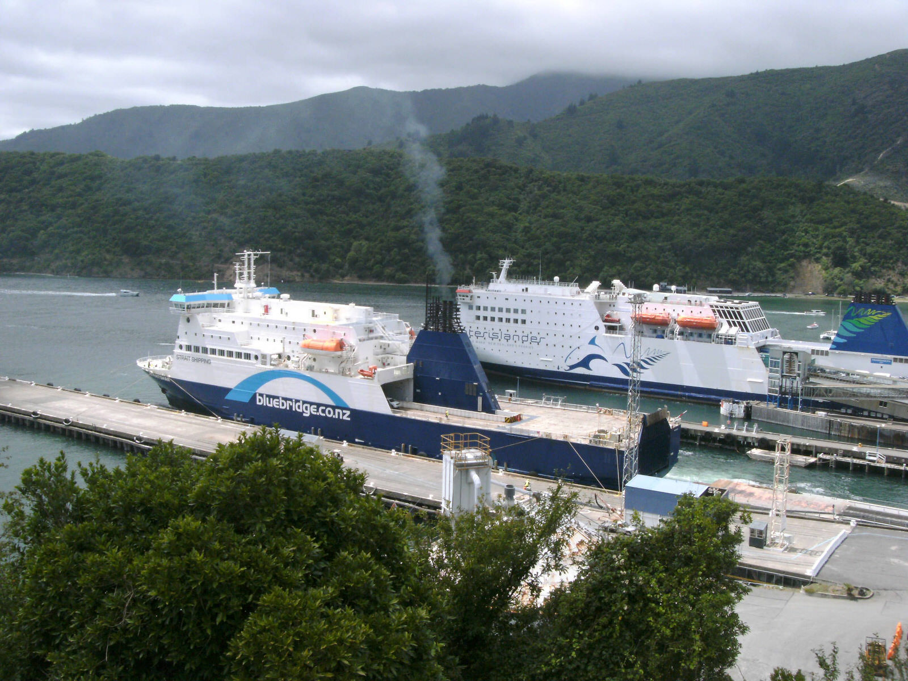
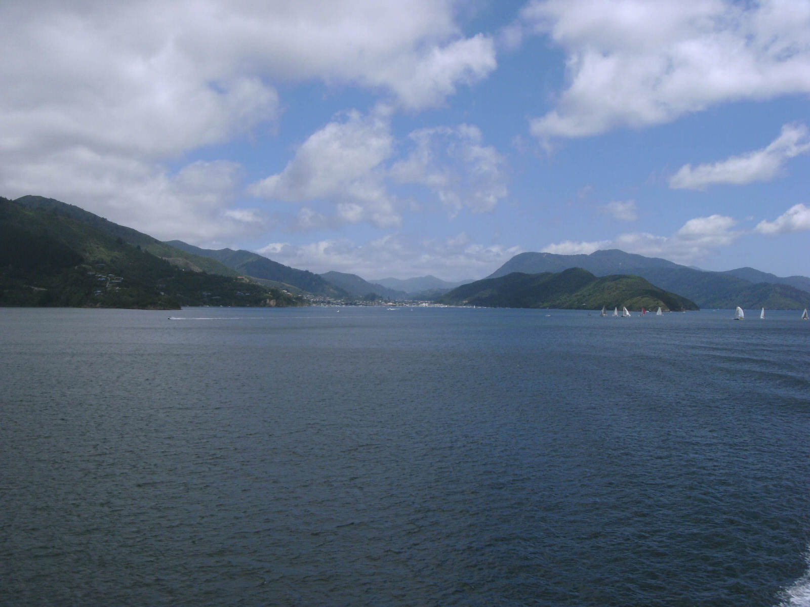
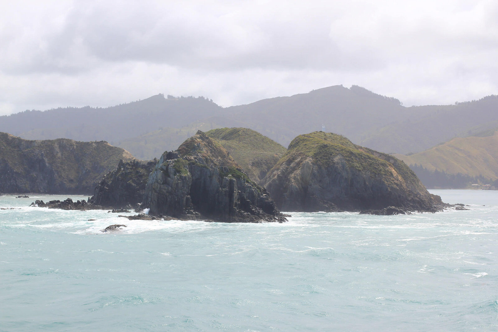
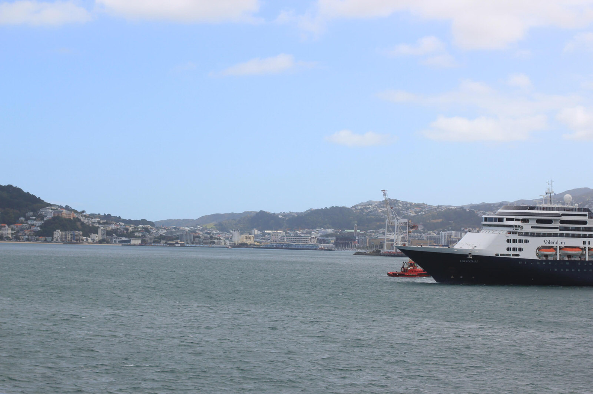

Heute ging es dann über Nelson nach Picton, von wo aus wir samt Auto mit der Fähre bei ziemlich rauer See über das Tasman Meer nach Wellington fuhren... Da wir an dieser Stelle unsere Reise auf der Südinsel abschließen, ist es Zeit für ein kleines Resümee :)

Nach gefahrenen 3.139 Km von Christchurch – Akaroa – Dunedin – Catlins – Te Anau – Queenstown – Fox Glacier – Marahau - Picton, haben wir doch sehr vieles erlebt und viele unterschiedliche Orte besucht. Wir verlassen die Südinsel mit einem weinenden Auge aufgrund der verpassten Fox-Gletscherwanderung und einem wesentlich größerem lachenden Gesicht aufgrund der tollen Erlebnisse in all unseren „Haltestellen“. Seien es die Begegnungen mit Pinguinen und Delphinen in Akaroa auf der tollen Segeltour, die naturnahe Pinguinwanderung in Dunedin, die Cathedral Caves in den Catlins, die Milford Sound-Tour und der Key Summit Track um Te Anau, die tollen Burger und Ausblicke in Queenstown oder das See Kajaken und die wunderschöne Wanderung des Abel Tasman Coastal Tracks… All dieses wird uns wohl sehr lange in Erinnerung bleiben und selbst nach unserer noch weit in der Ferne liegenden Rückreise :) werden wir uns wohl an den Erlebnissen und Eindrücken erfreuen können…

Doch nun wollen wir auch nicht wehmütig werden :) eine ebenso spannende und erlebnissreiche Nordinsel wartet auf uns. Es steht noch vieles auf dem Zettel, was wir auf der Nordinsel Neuseelands erleben wollen. Seid gespannt auf unsere nächsten Berichte…
Doch vorab vielleicht noch ein paar Bilder des wunderschönen Marlborough Sounds, den wir mit der Interislander-Fähre nach Wellington durchfahren haben…

[raw]
[/raw]

[raw]
[/raw]
