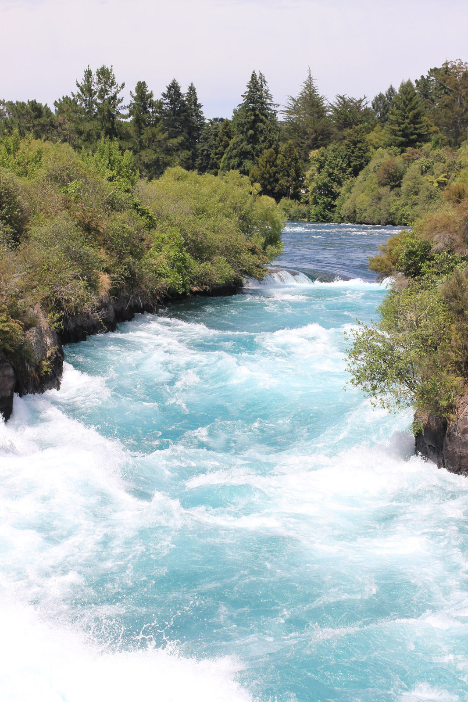
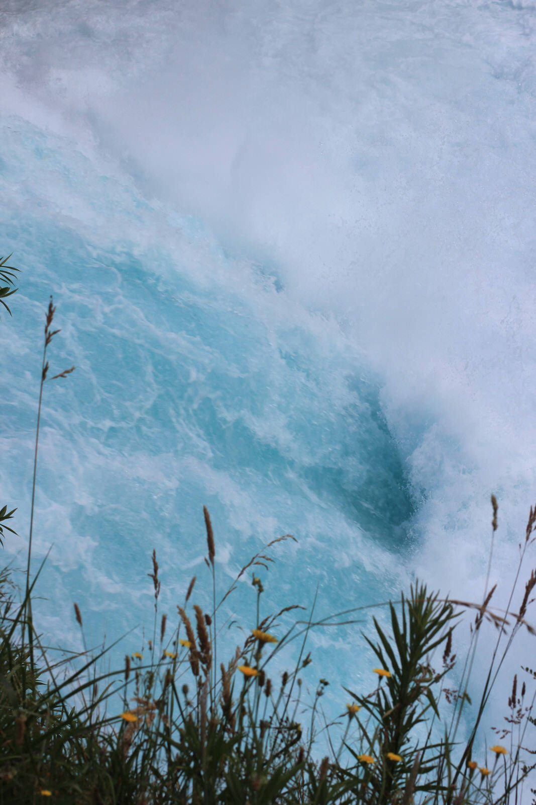
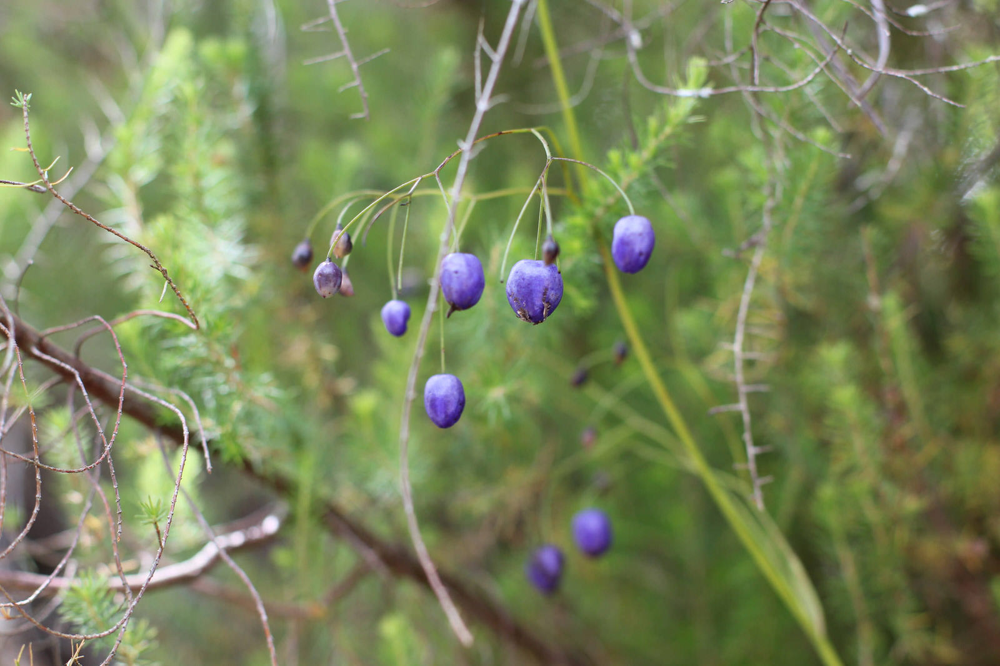
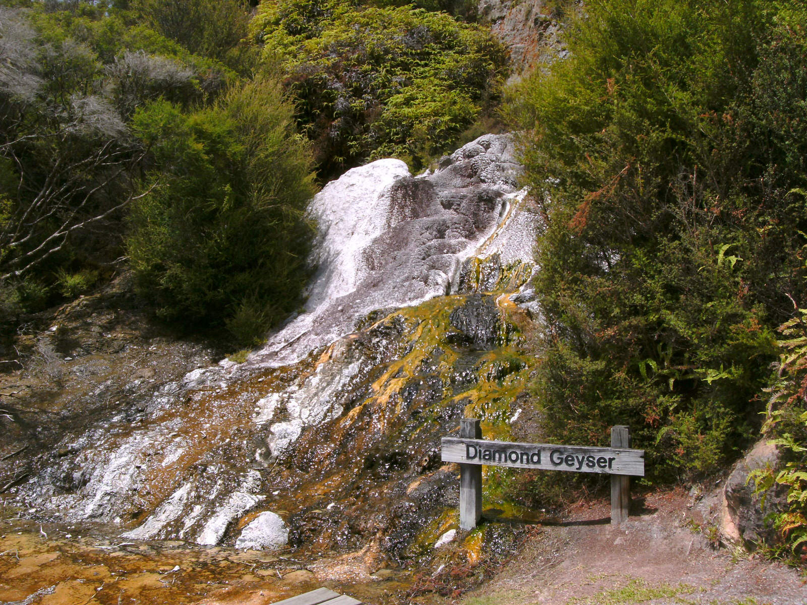
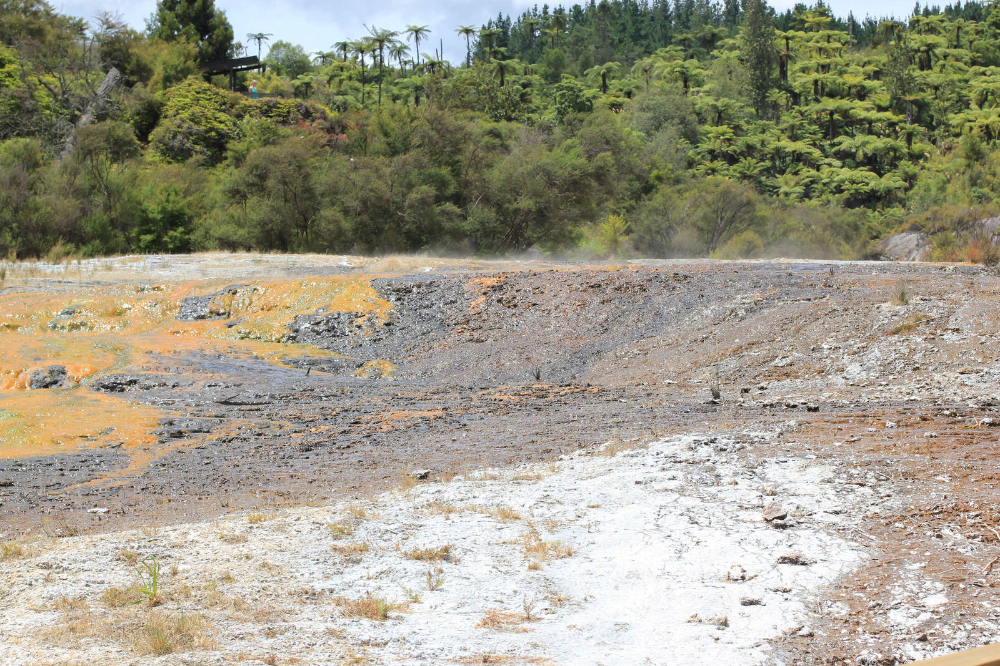
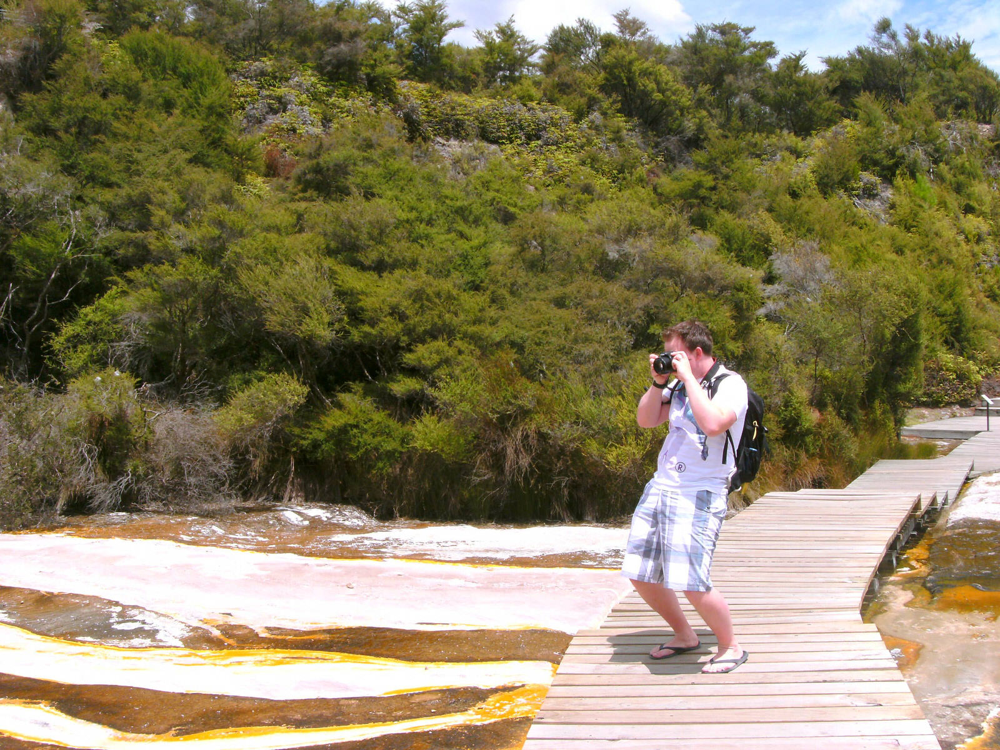
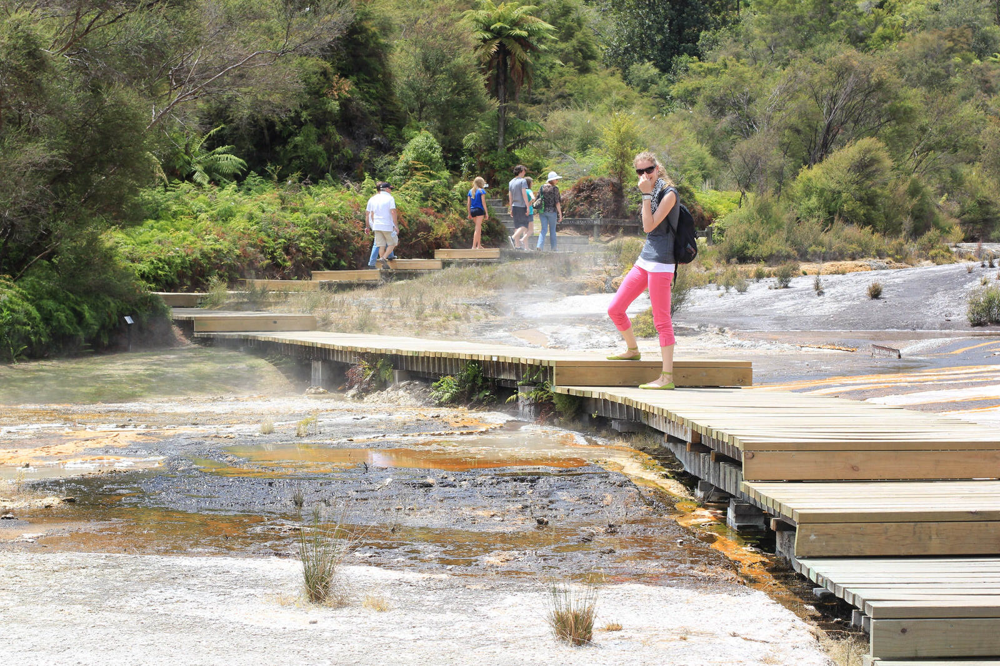
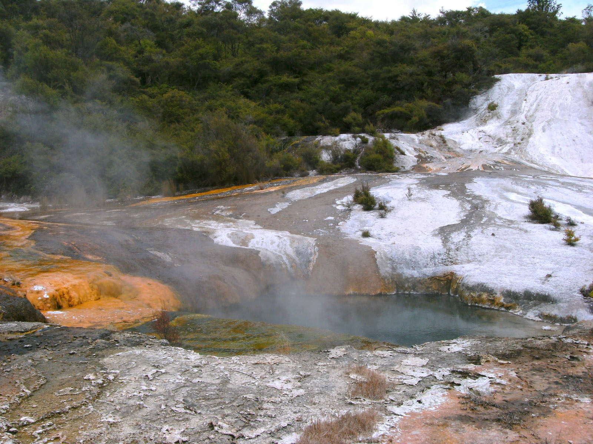
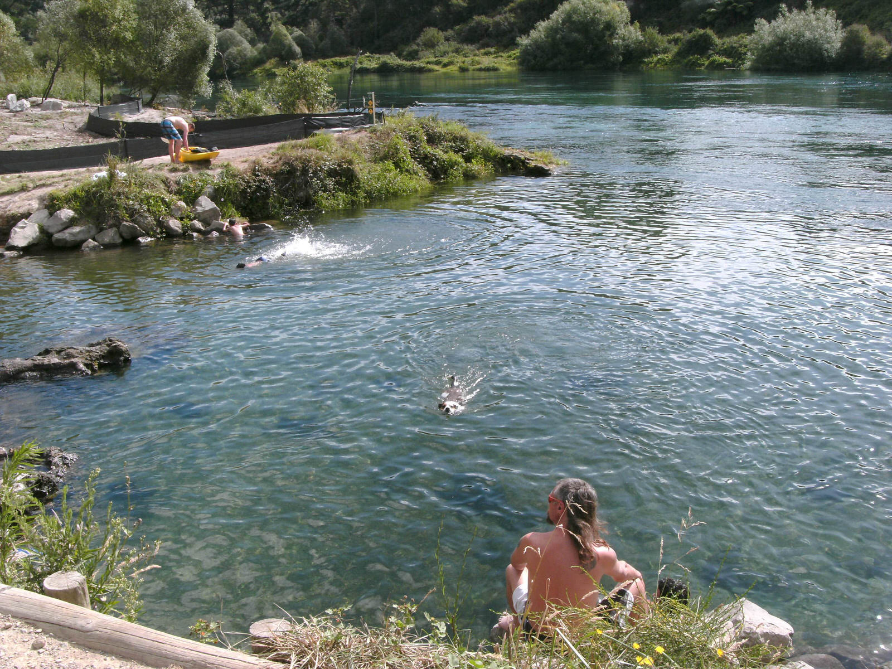

Nach dem doch recht verlassenen Tongariro Nationalpark ging es auf nach Taupo, der Stadt die am größten See Australasiens – dem Taupo Lake – liegt. Der See ist genauso groß wie Singapur, wo 4,8 Millionen Menschen leben. In ganz Neuseeland leben gerade einmal 4,2 Millionen Menschen – einer Broschüre zu Folge hat jeder Neuseeländer ein Fläche des gesamten See’s für sich allein…

Taupo ist neben dem riesigen See und dem Angeln (vor allem fliegende Fische) auch für seine thermalen Aktivitäten und Wasserfälle bekannt. Zunächst  fuhren wir zu den Huka Falls, an denen pro Sekunde 250.000 Liter sauberes, türkises Wasser runterstürzen. Anschließend wartete das geothermale Wunderland: Orakei Korako auf unsere Entdeckung :) Es gab viele kleinere Geysere, kochende Quellen, blubbernder Schlamm und tolle Farbenspiele zu sehen.
Aufgrund von Schwefeldämpfen lag an vielen Stellen der Geruch von verfaulten Eiern in der Luft, doch die verschiedenen Eindrücke machten die Gerüche bei weitem wieder wett  :)

[raw]
[/raw]

[raw]
[/raw]

Nach den thermalen Wundern zum Anschauen, wollten wir unbedingt mal in einem natürlich beheizten Hot Water Pool baden. So fuhren wir zu einer Art Badeanstalt, die mit dem natürlich heißen Wasser einer Quelle ihre Becken und Pools füllt. Nach dem heißen Badespaß aßen wir noch lecker in einem Restaurant mit typisch neuseeländischer Küche.
