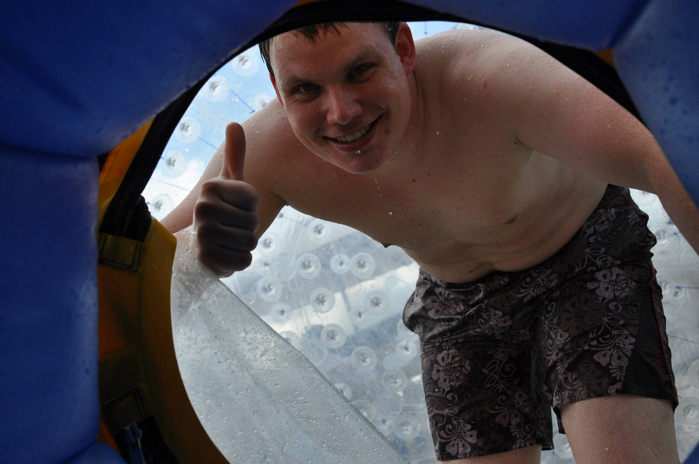

1 Stunde Fahrzeit liegt zwischen Taupo und Rotorua. Kurz vor Rotorua liegt ein weiteres Thermales Gebiet: Wai-O-Tapu, welches wir gleich morgens besuchten, um den Lady Gnox Geyser um 10:15 sprudeln zu sehen. Nach dem Ticketkauf beeilten wir uns, um noch rechzeitig zum Wasserspucker zu kommen. Auf dem Weg rätselten wir noch warum der Geyser immer zur selben Zeit sprudelte. Doch dann kam die Ernüchterung. Eine riesen Menschenmasse versammelte sich um den Lady Gnox und zur besagten Stunde trat ein Parksprecher mit Mikro an den Krater und erklärte, dass dem Geyser etwas mit einer natürlichen Seife zum Ausbruch nachgeholfen wird. Durch die Seife soll sich das heiße oben -und das kalte unten schwimmende Wasser vermischen und so zu einem Ausbruch führen. Nach dem der sehr touristische Geyser nach dem Seifeneinschmiss speite, gingen wir noch die interessanten Wanderwege entlang an verschiedenfarbenen Seen, dampfenden Kratern und Wäldern.

[raw]
[/raw]

[raw]
[/raw]

In einem Prospekt lasen wir von einer Blaubeerfarm und machten uns auf zur Mamaku Blue Farm. Dort angelangt verkosteten wir leckeren Beerenwein, Marmelade und gönnten uns ein super leckeres, selbstgemachtes Blaubeereis.

In Rotorua wurde das Zorbing erfunden. Innerhalb einer Art großen Luftballons stürzt man sich einen Berg hinunter. Teils ist der Luftballon noch mit Wasser gefüllt oder man wird in diesem angeschnallt, so dass man sich sehr häufig überschlägt. Nach kurzem Überlegen entschloss ich mich dann auch den Zorb zu probieren. Dadurch, dass leider z.Zt. nur die Wasservariante angeboten wurde, viel die Entscheidung nicht schwer und peste in der Luftkugel den Berg hinunter. Es machte super viel Spaß! Hier ein paar Bilder, falls man sich nicht so ganz solch einen „Luftballon“ vorstellen kann… :)

[raw]
[/raw]

[raw]
[/raw]

Nach dem feuchtfröhlichen Zorbing fuhren wir zu unser Unterkunft. Im Robertsons B&B, dem ältesten Haus von Rotorua, wurden wir sehr herzlich empfangen und erhielten gleich von John einige Tips zur restlichen Tagesplanung.

Zu Fuß machten wir uns dann auf in die Stadt und wollten der Empfehlung von John folgen und das kleine nicht touristische Maori Dorf am See besuchen. Nach einem länger als gedachten Fußmarsch kam uns alles etwas unheimlich vor und es standen auch einige „Striktly no entry“ Schilder herum, so dass wir nach einem schnellen Foto auch wieder von dannen zogen. Auf dem Rückweg entdeckten wir noch einen sehr netten „Night Market“ wo Stadtbewohner selbsthergestellte/gekochte Leckerein und tolle Handwerkskunst verkauften.

[raw]
[/raw]

[raw]
[/raw]

Nach einem schnellen Einkauf fürs eigene Abendbrot, fuhren wir mit dem Auto zu dem Blue Lake (einer der vielen Seen um Rotorua herum) wo wir uns schön am Seeufer hinsetzten, mit Käse, Wurst, verschiedenen Dips, Baguette und einigen Enten und Vögeln ließen wir den Abend ausklingen :)

[raw]
[/raw]

[raw]
[/raw]
