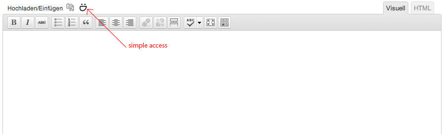
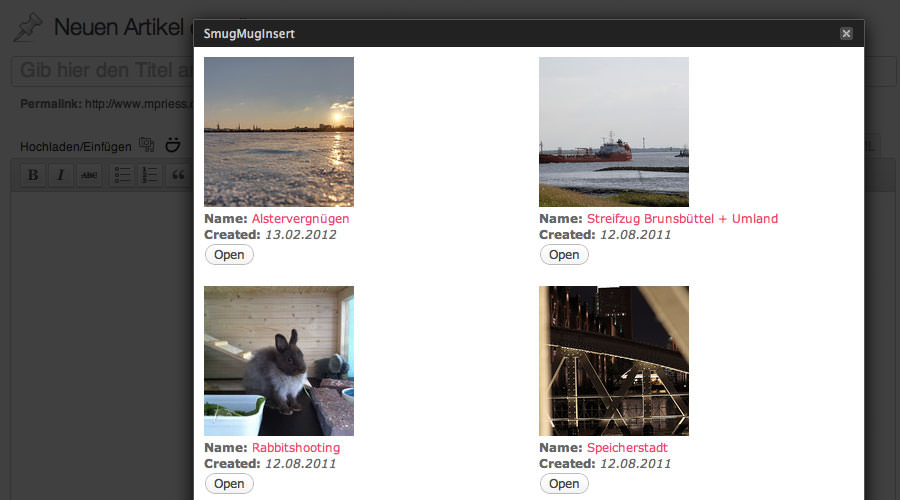
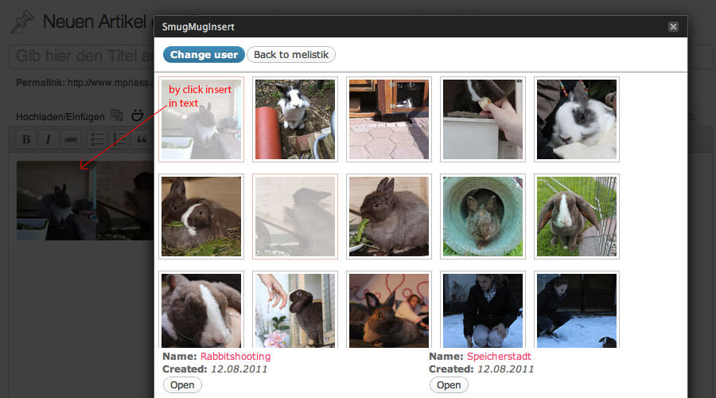

Nachdem ich vor ca. 1 Jahr von Picasa auf Smugmug umgestiegen bin habe ich ein einfaches Plugin zur Bildverknüpfung für Wordpress schmerzlich vermisst. Vorallem meine Neuseelandberichte habe ich sehr angenehm mit dem GPicasa-Plugin vervollständigen können. Auf Basis dessen habe ich mich einige Abende mit den Smugmug Rss-Feeds, jQuery und den generellen Wordpress-Plugins beschäftigt. Das Ergebnis ist nun ein GPicasa-Ableger mit Verknüpfung zu Smugmug - kurz genannt SmugIns...

In den nächsten Tagen werde ich diesen Plugin auch bei Wordpress direkt veröffentlichen :)
Mir gefällt es sehr und alle bestehenden Neuseelandberichte habe ich hiermit auf Smugmug als Bildquelle aktualisiert...

Update: Ist nun auch bei Wordpress als Plugin gelistet :)
[wordpress-plugins](http://wordpress.org/extend/plugins/smugmug-insert/)
